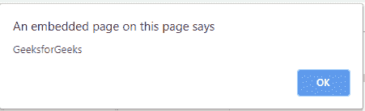

# 什么时候用香草 JavaScript vs jQuery？

> 原文:[https://www . geesforgeks . org/何时使用-香草-javascript-vs-jquery/](https://www.geeksforgeeks.org/when-to-use-vanilla-javascript-vs-jquery/)

以前，网站是静态的。然而，普通 JavaScript 的引入彻底改变了网站的外观和功能。香草 JS 帮助开发者创建动态网站。然后是 jQuery，一个由世界各地的开发人员使用 Javascript 创建的工具库。

简而言之，jQuery 是一个轻量级且易于使用的 JavaScript 库，有助于用很少的代码创建复杂的功能。jQuery 有助于 CSS 操作、发出 AJAX 请求、处理从服务器接收到的 JSON 数据，还有助于向组件添加隐藏、显示等动画效果。最棒的是 jQuery 浏览器灵活。这意味着 jQuery 兼容市场上的所有浏览器，因此开发人员不必担心用户可能使用的浏览器。

jQuery 简化了很多事情。使用 jQuery 实现一些东西比普通的 JS 更容易。看看这个例子。在这里，一旦用户点击`'click here for popup!"`按钮，我们必须在屏幕上显示一条弹出消息。

**jQuery Code:**

```
<!DOCTYPE html>
<html>

<head>
    <link rel="stylesheet"
          href="styles.css">
    <script src="app.js"></script>
    <script src=
"https://ajax.googleapis.com/ajax/libs/jquery/3.4.1/jquery.min.js">
    </script>
</head>

<body>
    <input id="button1" type="button"
           value="click here for popup!" />

    <script>
        $('#button1').click(function() {
            alert("GeeksforGeeks");
        });
    </script>
</body>

</html>
```

**输出:**

*   **点击按钮前:**
    
*   **点击按钮后:**
    

**JavaScript 代码:**

```
<!DOCTYPE html>
<html>

<head>
    <link rel="stylesheet" href="styles.css">
    <script src = "app.js"></script>
</head>

<body>
    <input id="button1" type="button"
        value="click here for popup!"/> 

    <script>
        document.getElementById("button1")
            .addEventListener('click', function(){ 
                alert("GeeksforGeeks");
            });
    </script>
</body>

</html>
```

**输出:**

*   **点击按钮前:**
    
*   **点击按钮后:**
    

很容易看出，jQuery 编码比普通的 JS 代码更短、更简单。让我们看一下另一个例子，以便更好地理解。

假设程序员想要选择类名= `'hello'`的所有元素。
**Javascript**

```
document.getElementsByClassName("hello");  
```

**jQuery**

```
$('.hello')
```

没有书面的规则手册告诉我们在哪里使用 jQuery，在哪里使用 JavaScript。据说 jQuery 比 Javascript 更适合 DOM 操作，然而在监控了两者的性能后，发现香草 JS 比 jQuery 更快。然而，对于新手程序员来说，使用 Javascript 编写复杂的功能可能很困难。

### jQuery vs Javascript

| **JavaScript** | **jQuery** |
| 一种弱类型的动态编程语言。 | 一个丰富、轻量级且易于使用的 JavaScript 库。 |
| 一种用于创建动态网站用户友好界面的脚本语言。 | JS 框架，用于处理 AJAX 请求，操作 CSS，创建动画，如幻灯片，隐藏等。 |
| 所有的编码都必须从头开始。对于新手程序员来说，这可能会很困难，也很耗时。 | jQuery 有几个预写的函数。只需进行必要的修改。节省了很多时间。 |
| 开发人员必须注意多浏览器的兼容性。浏览器相关的错误更喜欢出现。 | jQuery 适用于所有现代浏览器。任何浏览器都不存在这种兼容性问题。 |
| 运行 JS 不需要额外的插件。不需要添加任何额外的插件，因为所有浏览器都支持 JavaScript。 | jQuery 库脚本链接必须包含在网页的标题标签中。 |
| 一长串代码。可能会导致意大利面代码。 | 做同样的工作需要更少的编码。 |
| 可以更快地访问 DOM。 | 它最适合复杂的操作，在这些操作中，开发人员通常会犯错误并编写糟糕的代码行。 |
| 不容易学。学习曲线陡峭。 | 相对容易学。 |

简而言之，jQuery 是与 WordPress、Weebly 等 CMS 网站合作的更好选择。它使开发变得更加容易，因为它已经有了庞大的插件库。然而，即使 jQuery 是用 Javascript 编写的，忽略普通的 Javascript 也不是一个明智的决定。如果你想成为一名前端或全栈网络开发人员，那么学习普通的 JS 是必要的。这是因为 Javascript 还有其他框架和库，比如 Angular、React 和 Vue，它们比 jQuery 有很多优势。这就是为什么建议首先深入学习香草 JS，因为库和框架会来来去去，但它们的基础永远是香草 JS。这就是为什么在面试中，懂 Javascript 的候选人会比懂 jQuery 的其他候选人占有优势。

还必须知道，一个正在学习香草 JS 的人会发现切换到 jQuery 更容易。然而，从 jQuery 切换到 Javascript 一开始可能看起来并不顺利。根据最近的一项调查，据观察，在互联网上排名前 100 万的网站中，约有 77%使用 jQuery，首先学习普通语言总是前进的最佳方式。