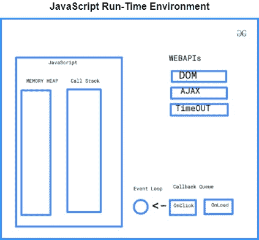

# 为什么 JavaScript 是一种可以无阻塞的单线程语言？

> 原文:[https://www . geesforgeks . org/why-JavaScript-is-单线程语言-可以是非阻塞的/](https://www.geeksforgeeks.org/why-javascript-is-a-single-thread-language-that-can-be-non-blocking/)

chrome 浏览器中的 JavaScript 由 V8 引擎实现。

**The V8 engine has two parts:**

*   内存堆*   Call Stack

    **内存堆:**用于分配你的 JavaScript 程序使用的内存。记住内存堆和堆数据结构不一样，它们是完全不同的。这是你的操作系统内部的自由空间。

    **调用栈:**在调用栈中，您的 JS 代码被一行行地读取和执行。

    现在，JavaScript 是一种单线程语言，这意味着它只有一个用于执行程序的调用堆栈。调用堆栈与您可能在数据结构中读取的堆栈数据结构相同。众所周知，堆栈是先进先出的 FILO。类似地，在调用堆栈中，每当一行代码进入调用堆栈时，它就会被执行并移出堆栈。这样，因为只有一个调用栈，所以 JavaScript 是一种单线程语言。

    JavaScript 是一种单线程语言，因为在单线程上运行代码时，它可以非常容易地实现，因为我们不必处理多线程环境中出现的复杂场景，如死锁。

    因为 JavaScript 是单线程语言，所以本质上是同步的。现在，你会想知道你在 JavaScript 中使用了异步调用，那么这可能吗？

    因此，让我向您解释 JavaScript 中异步调用的概念，以及单线程语言是如何实现的。在解释之前，我们先简单讨论一下为什么需要异步调用。正如我们在同步调用中所知道的，所有的工作都是逐行完成的，即首先执行一个任务，然后执行第二个任务，不管一个任务需要多长时间。这就产生了时间浪费和资源浪费的问题。异步调用克服了这两个问题，异步调用不等待一个调用完成，而是同时运行另一个任务。因此，当我们必须进行图像处理或通过网络发出请求(如应用编程接口调用)时，我们使用异步调用。

    现在，回到前面的问题，如何在 JS 中使用异步调用。在 JS 中，我们有一个词法环境、语法解析器、一个用于执行 JS 代码的执行上下文(内存堆和调用栈)。但是除此之外，这些浏览器还有事件循环、回调队列和也用于运行 JS 代码的 WebAPIs。虽然这些不是 JS 的一部分，但它也有助于正确执行 JS，因为我们有时会在 JS 中使用浏览器功能。

    

    如上图所示，DOM、AJAX 和超时实际上不是 JavaScript 的一部分，而是 RunTime Environment 或浏览器的一部分，因此可以使用回调队列在 WebAPI 中异步运行，并再次使用事件循环将其放入调用堆栈中执行。

    让我们举个例子来明确这个概念。假设我们想要在 JS 运行时环境中执行下面这段代码。

    **示例:**

    ```
    <script>
     console.log('A');

     setTimeout(() => {
        console.log('B');
       }, 3000);

     console.log('C');
    </script>
    ```

    **输出:**

    ```
     A C B
    ```

    让我们看看为什么会发生这种情况，因为 JavaScript 是一种单线程语言，所以输出应该是 **A B C** ，但它不是。

    当 JS 试图执行上述程序时，它将第一条语句放在调用堆栈中，该语句被执行，并在控制台中打印出 A，然后从堆栈中弹出。现在，它将第二条语句放在调用堆栈中，当它试图执行该语句时，它发现 setTimeout()不属于 JS，所以它弹出该函数，并放入 WebAPI 在那里执行。由于调用堆栈现在再次为空，它将第三条语句放入堆栈中并执行它，从而在控制台中打印 C。

    同时，WebAPI 执行超时函数，并将代码放入回调队列。eventloop 检查调用堆栈是否为空，或者回调队列中是否有任何语句需要一直执行。一旦事件循环检查到调用堆栈为空，并且回调队列中有需要执行的内容，它就会将该语句放入调用堆栈中，调用堆栈执行该语句，并在浏览器的控制台中打印 B。