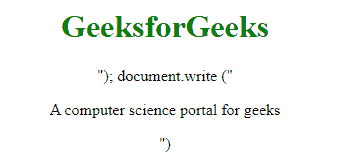

# Why split the `<script>` tag when writing it within document.write() method in JavaScript ?

> 原文：[https://www.geeksforgeeks.org/why-split-the-script-tag-when-writing-it-within-document-write-method-in-javascript/](https://www.geeksforgeeks.org/why-split-the-script-tag-when-writing-it-within-document-write-method-in-javascript/)

The code within the script tag is executed when the browser processes the tag. The **[document.write()](https://www.geeksforgeeks.org/html-dom-write-method/)** method is used to delete all the existing content from the HTML document and inserts the new content specified within **document.write()** method. However, before the browser loads a page it builds the DOM tree by parsing the HTML markup. Whenever a script tag is encountered it must be executed before proceeding with the process of parsing. The script tag is split when used within **document.write()** method because while parsing the HTML parser on seeing the **“</"”** of the script tag inside the **document.write()** considers it to be the closing tag for the script tag within which the **document.write()** is enclosed. This results in incomplete execution of the contents in the outer script tags. In modern days, use of **document.write()** method is highly discouraged as it causes performance issues and may not work at all in certain cases.

**Note:** This procedure have been used to include jQuery files only.

Below examples implements the above approach:

**Example 1:** In this example, we will use <script> inside the document.write without splitting the tag.

```
<!DOCTYPE html> 
<html> 

<head> 
    <style> 
        body { 
            text-align:center; 
        } 
        h1 { 
            color:green; 
        } 
    </style> 
</head> 

<body> 
    <h1>GeeksforGeeks</h1>

    <script> 
        document.write(
        "<script><h1>GeeksforGeeks!</h1></script>"); 

        document.write(
        "<p>A computer science portal for geeks</p>") 
    </script> 
</body> 

</html>
```

**Output:**


**Example 2:** In this example we will use <script> inside the document.write by splitting the tag.

```
<!DOCTYPE html> 
<html> 

<head> 
    <style> 
        body { 
            text-align:center; 
        } 
        h1 { 
            color:green; 
        } 
    </style> 
</head> 

<body> 
    <h1>GeeksforGeeks</h1>

    <script> 
        document.write(
        "<script><h1>GeeksforGeeks!</h1></scr"+"ipt>"); 

        document.write(
        "A computer science portal for geeks"); 
    </script> 
</body> 

</html>
```

**Output:**
