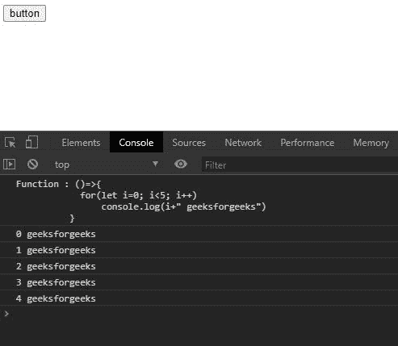

# 洛达什 _。bindAll()方法

> 原文:[https://www.geeksforgeeks.org/lodash-_-bindall-method/](https://www.geeksforgeeks.org/lodash-_-bindall-method/)

洛达什 **_。bindAll()方法**用于绑定对象上的方法数量。每个方法都有一个方法名。使用事件处理程序很方便。

**语法:**

```
_.bindAll(object, methodNames)
```

**参数:**该方法接受两个参数，如上所述，如下所述:

*   **对象:**是包含不同方法和函数进行绑定的对象。
*   **方法名称:**是对象中存在的方法的名称。

**返回值:**返回一个对象。

**注意:**该方法不设置有界函数的“长度”属性。

下面的例子说明了 Lodash _。JavaScript 中的 bindAll()方法:

**例 1:**

## java 描述语言

```
<!DOCTYPE html>
<html>

<head>
    <script src=
"https://cdn.jsdelivr.net/npm/lodash@4.17.11/lodash.min.js">
    </script>
</head>

<body>
    <button id="button">button</button>

    <script type="text/javascript">

        var object={
                label  : 'GeeksforGeeks',
                click: function(){
                    console.log( 'clicked: ' + this.label);
                    },
                hover: function(){
                    console.log( 'hovering: ' + this.label);
                    }
                };

        // Using bindAll() method of lodash
        _.bindAll(object, 'click', 'hover');

        // When the button is clicked, 
        // this.label will have the correct value.
        let btn=document.querySelector("#button");

        btn.addEventListener('click', object.click);
        btn.addEventListener('click', object.hover); 
    </script>
</body>

</html>
```

**输出:**


**例 2:**

## java 描述语言

```
<!DOCTYPE html>
<html>

<head>
    <script src=
"https://cdn.jsdelivr.net/npm/lodash@4.17.11/lodash.min.js">
    </script>
</head>

<body>
    <button id="button">button</button>
    <script type="text/javascript"> 
        var object={
            printNum:()=>{
                for(let i=0; i<5; i++)
                    console.log(i+" geeksforgeeks")
                },
            func: function(){ console.log(
                'Function : ' + this.printNum);
                },
            output: function(){ "Output : "+this.printNum();
                }
            };

        // Using bindAll() method of lodash
        _.bindAll(object, 'func', 'output');

        // When the button is clicked 
        let btn=document.querySelector("#button");

        btn.addEventListener('click', object.func);
        btn.addEventListener('click', object.output);
    </script>
</body>

</html>
```

**输出:**



**参考:**T2**https://docs-lodash.com/v4/bind-all/**T5】