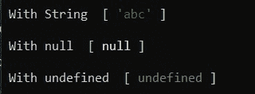
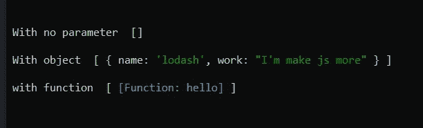
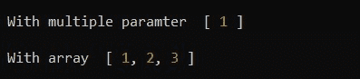

# Lodash | _。castArray()方法

> 原文:[https://www.geeksforgeeks.org/lodash-_-castarray-method/](https://www.geeksforgeeks.org/lodash-_-castarray-method/)

**_。castArray()方法**用于将值转换成数组，如果它不是数组的话。

**语法:**

```
_.castArray( value )
```

**参数:**该方法接受如上所述的单个参数，描述如下:

*   **值:**该参数保存需要检查的值。

**返回值:**它返回一个数组，该数组包含在 _。castArray()。

**示例 1:** 本示例使用整数值作为参数。

## java 描述语言

```
const _ = require('lodash');

let x = 10;

let arr = _.castArray(x);

console.log("\n\nThe value returned to by _castArray(x) is", arr);
```

这里，const _ = require('lodash ')用于将 lodash 库导入文件。
**输出:**


**示例 2:** 此示例使用 String、null 和 undefined 作为参数。

## java 描述语言

```
const _ = require('lodash');

let x = _.castArray('abc');

console.log('\n With String ', x );

let y = _.castArray(null);

console.log('\n With null ', y );

let z = _.castArray(undefined);

console.log('\n With undefined ', z);
```

**输出:**



**例 3:** 无参数、无对象、无函数。

## java 描述语言

```
const _ = require('lodash');

let x = _.castArray();

console.log("\n With no parameter ", x);

let y = _.castArray({"name":"lodash",
         "work":"I'm make js more" });

console.log("\n With object ", y);

let z = _.castArray(function hello() {
    console.log("hello");
});

console.log("\n with function ", z);
```

**输出:**



**例 4:** 这个例子使用了多个参数，它将只取第一个参数并且用一个数组，它将只返回同一个数组。

## java 描述语言

```
const _ = require('lodash');

let x = _.castArray(1, 2, "hello");

console.log('\n With multiple parameter ', x);

let y = _.castArray([1, 2, 3]);

console.log('\n With array ', y);
```

**输出:**



**注意:**这在正常的 JavaScript 中不会起作用，因为它需要安装库 lodash。
T3【参考:T5【https://lodash.com/docs/4.17.15#castArray】T6