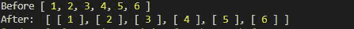
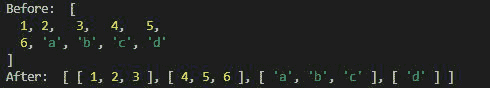
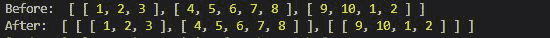
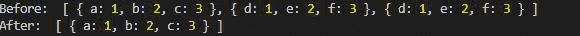

# 洛达什 _。组块()方法

> 原文:[https://www.geeksforgeeks.org/lodash-_-chunk-method/](https://www.geeksforgeeks.org/lodash-_-chunk-method/)

Lodash 是一个工作在下划线之上的 JavaScript 库。Lodash 有助于处理数组、字符串、对象、数字等。 **Loadsh.chunk()** 函数用于将数组分成小块。每个**块**都是给定大小的数组。

**语法:**

```
chunk(array, size)
```

**参数:**该功能接受两个参数，如上所述，描述如下。

*   **数组:**由组块函数处理的数组。
*   **大小:**这描述了块的大小。

**返回值:**返回也是数组的块数组

**注意:**在使用下面给出的代码之前，请使用命令`npm install lodash`安装 lodash 模块。

**例 1:**

## java 描述语言

```
// Requiring the lodash module
// in the script
const _ = require("lodash");
let arr = [1, 2, 3, 4, 5, 6];

// Making chunks of size 1
console.log(_.chunk(arr, 1))
```

**输出:**



输出示例 1

**示例 2:** 块的大小可以变化，不同数据类型的数组可以与块函数一起使用。

## java 描述语言

```
// Requiring the lodash module
// in the script
let _ = require("lodash");
let arr = [1, 2, 3, 4, 5, 6, 
        "a", "b", "c", "d"];
console.log("Before: ", arr)

// Making chunks of size 3
console.log("After: ", _.chunk(arr, 3))
```

**输出:**



**例 3:** 使用带组块数组的数组。

## java 描述语言

```
// Requiring the lodash module 
// in the script.
let lodash = require("lodash");
let arr = [
    [1, 2, 3], 
    [4, 5, 6, 7, 8], 
    [9, 10, 1, 2]
];

console.log("Before: ", arr)
console.log("After: ", lodash.chunk(arr, 2))
```

**输出:**



**示例 4:** 使用带有块的对象数组。

## java 描述语言

```
let lodash = require("lodash");
let arr = [
    { "a": 1, "b": 2, "c": 3 }, 
    { "d": 1, "e": 2, "f": 3 }, 
    { "d": 1, "e": 2, "f": 3 }
];

// Array before breaking in to chunks
console.log("Before: ", arr)

// Printing the first element 
// of the chunk as size 1
console.log("After: ", 
    lodash.chunk(arr, 1)[0]);
```

**输出:**

