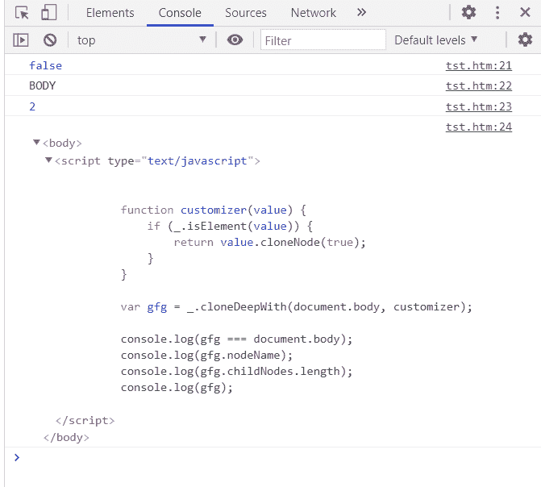

# 洛达什 _。克隆 epWith()方法

> 原文:[https://www . geeksforgeeks . org/lo dash-_-clonedeewith-method/](https://www.geeksforgeeks.org/lodash-_-clonedeepwith-method/)

**洛达什 _。cloneedepwith()**方法用于递归克隆值，就像的 **_。方法，但以递归方式执行。**

**语法:**

```
_.cloneDeepWith( value, customizer )

```

**参数:**该方法接受两个参数，如上所述，如下所述:

*   **值:**此参数保存将以递归方式克隆的值。
*   **定制器:**此参数保存定制克隆的功能。

**返回值:**该方法返回克隆值。

下面的例子说明了 Lodash _。克隆带有()方法:

**实施例 1:** 克隆头部元件。

## java 描述语言

```
<!DOCTYPE html>
<html>

<head>
    <script src=
"https://cdn.jsdelivr.net/npm/lodash@4.17.11/lodash.min.js">
    </script>
</head>

<body>
    <script type="text/javascript">

        function customizer(value) {
            if (_.isElement(value)) {
                return value.cloneNode(true);
            }
        }

        var gfg = _.cloneDeepWith(document.head, customizer);

        console.log(gfg === document.head);
        console.log(gfg.nodeName);
        console.log(gfg.childNodes.length);
        console.log(gfg);
    </script>
</body>

</html>
```

**输出:**


**例 2:** 克隆体元素。

## java 描述语言

```
<!DOCTYPE html>
<html>

<head>
    <script src=
"https://cdn.jsdelivr.net/npm/lodash@4.17.11/lodash.min.js">
    </script>
</head>

<body>
    <script type="text/javascript">

        function customizer(value) {
            if (_.isElement(value)) {
                return value.cloneNode(true);
            }
        }

        var gfg = _.cloneDeepWith(document.body, customizer);

        console.log(gfg === document.body);
        console.log(gfg.nodeName);
        console.log(gfg.childNodes.length);
        console.log(gfg);
    </script>
</body>

</html>
```

**输出:**



**参考:**T2**https://docs-lodash.com/v4/clone-deep-with/**T5】