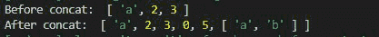

# 洛达什 _。concat()功能

> 原文:[https://www.geeksforgeeks.org/lodash-_-concat-function/](https://www.geeksforgeeks.org/lodash-_-concat-function/)

**Lodash** 在处理数组、字符串、对象等时非常有用。它使数学运算和函数范式变得更加容易、简洁。 **_。concat()函数**用于在 JavaScript 中串联数组。

**语法:**

```
_.concat(array, [values])
```

**参数:**该函数接受两个参数，如上所述，如下所述:

*   **数组:**是要添加值的数组。
*   **值:**是要添加到原始数组中的值数组。

**注意:**数组值也可以包含数组的数组或者简单的一个要添加到原始数组的单个对象。

**返回值:**该函数返回串联后的数组。

为了更好地理解函数，下面给出了几个例子。

**例 1:**

## java 描述语言

```
// Requiring the lodash library
let lodash = require("lodash");

// Original array to be concatenated
let array = [1, 2, 3];

// Values to be added to original array
let values = [0, 5, "a", "b"]

let newArray = lodash.concat(array, values);
console.log("Before concat: " + array);

// Printing newArray
console.log("After concat: " + newArray);
```

**输出:**


**例 2:** 将数组的数组添加到原始数组。

## Java Script 语言

```
// Requiring the lodash library
let lodash = require("lodash");

// Original array to be concatenated
let array = ["a", 2, 3];

// Array of array to be added
// to original array
let values = [0, 5, ["a", "b"]]
let newArray = lodash.concat(array, values);
console.log("Before concat: ", array);

// Printing array
console.log("After concat: ", newArray);
```

**输出:**



**示例 3:** 本示例将对象添加到数组中。

## java 描述语言

```
// Requiring the lodash library
let lodash = require("lodash");

// Original array to be concatenated
let array = ["a", 2, 3];

// Object of values to be
// added to original array
let values = { "a": 1, "b": 2 }
let newArray = lodash.concat(array, values);
console.log("Before concat: ", array);

// Printing array
console.log("After concat: ", newArray);
```

**输出:**

