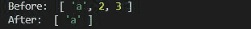
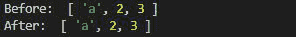

# 洛达什 _。区别()功能

> 原文:[https://www.geeksforgeeks.org/lodash-_-difference-function/](https://www.geeksforgeeks.org/lodash-_-difference-function/)

**_。difference()** 函数用于从原始数组中移除单个元素或元素数组。这个函数的工作原理和 JavaScript 的核心函数差不多，即过滤器。

**语法:**

```
_.difference(array, [values]);
```

**参数:**该函数接受两个参数，如上所述，如下所述:

*   **数组:**是要移除不同元素的数组。
*   **值:**是要从原始数组中删除的值数组。

**注:**

*   我们可以使用单个值或值的数组。但是如果只给出一个整数，那么它不会影响原始数组。
*   在进一步使用 **npm 安装 lodash 之前，请安装库。**

下面的例子说明了 _。Lodash 中的 difference()函数:

**例 1:** 给定值数组时。

## java 描述语言

```
// Requiring the lodash library
let lodash = require("lodash");

// Original array
let array = ["a", 2, 3];

// Values to be removed from
// the original array
let values = [2, 3]
let newArray = lodash.difference(array, values);
console.log("Before: ", array);

// Printing array
console.log("After: ", newArray);
```

**输出:**



**例 2:** 当给定一个空数组时，a 数组的原点不会发生变化。

## java 描述语言

```
// Requiring the lodash library
let lodash = require("lodash");

// Original array
let array = ["a", 2, 3];

// Values to be removed from
// the original array
let values = []
let newArray = lodash.difference(array, values);
console.log("Before: ", array);

// Printing array
console.log("After: ", newArray);
```

**输出:**



**注意:**如果值数组是单值、空数组或数组对象，则此函数返回原始数组。