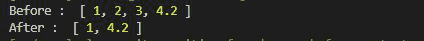
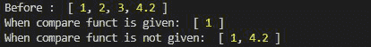

# 洛达什 _。差异比()方法

> 原文:[https://www.geeksforgeeks.org/lodash-_-differenceby-method/](https://www.geeksforgeeks.org/lodash-_-differenceby-method/)

**_。方法用于通过使用迭代函数迭代数组中的每个元素来从原始数组中移除值。几乎和 _。difference()函数。**

**语法:**

```
lodash.differenceBy(array, [values], [iteratee=_.identity])
```

**参数:**该函数接受三个参数，如上所述，如下所述

*   **数组:**这是要从中移除值的数组。
*   **值:**是要从原始数组中删除的值数组。
*   **迭代:**这是迭代每个元素的函数。

**注意:**如果没有给出迭代函数，那么 _。函数充当 _。difference()函数。

**返回值:**这个函数返回一个数组。

**例 1:**

## java 描述语言

```
// Requiring the lodash library
const _ = require("lodash");

// Ooriginal array
let array1 = [1, 2, 3, 4.2]

// Array to be subtracted
let val = [2, 3, 3, 5]

// New Array after _.differenceBy() 
// method where Math.double is the
// comparable function
let newArray = _.differenceBy(
    array1, val, Math.double);

// Printing the original array
console.log("Before : ", array1);

// Printing the output
console.log("After : ", newArray);
```

**输出:**



**例 2:**

## java 描述语言

```
// Requiring the lodash library
const _ = require("lodash");

// Original array
let array1 = [1, 2, 3, 4.2]

// Value array to be subtracted
let val = [2, 3, 4, 5]

// new Array after _.differenceBy()
// method where Math.double is the
// comparable function
let newArray1 = _.differenceBy(
    array1, val, Math.floor);

// New Array after _.differenceBy function
// where no comparable function is given
let newArray2 = _.differenceBy(array1, val);

// Printing the original array
console.log("Before : ", array1);

// Nrinting the output
console.log("When compare funct is given: ", 
        newArray1);

// Printing the output
console.log("When compare funct is not given: ", 
        newArray2);
```

**输出:**

