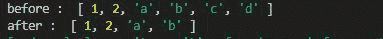
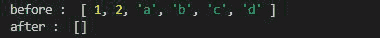

# 洛达什 _。下降()方法

> 原文:[https://www.geeksforgeeks.org/lodash-_-drop-method/](https://www.geeksforgeeks.org/lodash-_-drop-method/)

**Lodash** 是一个工作在下划线. js 之上的 JavaScript 库，Lodash 有助于处理数组、字符串、对象、数字等。
lodash . drop()方法用于放置给定数组中的元素。

**语法:**

```
Lodash.drop(array, number)
```

**参数:**

*   **数组:**是要删除元素的原始数组。
*   **Number:** 是要从数组中移除的元素数。

**注意:**元素从数组的索引 0 中移除。

**返回值:**返回分片数组。

**例 1:**

## java 描述语言

```
// Requiring the lodash library
const _ = require("lodash");

// Original array
let array = ["a", "b", "c", "d"]

// Ising drop() method to remove
// first two elements
let newArray = _.drop(array, 2)

// Printing original array 
console.log("before : ", array)

// Printing array after applying
// drop function
console.log("after : ", newArray)
```

**输出:**


**例 2:** 如果要从数组右侧移除元素，我们使用 _。 **dropRight()** 功能。

## java 描述语言

```
// Requiring the lodash library
let lodash = require("lodash");

// Original array
let array = [1, 2, "a", "b", "c", "d"]

// Using drop() method to remove 
// first 2 elements from right
let newArray = lodash.dropRight(array, 2)

// Printing original array 
console.log("before : ", array)

// Printing array after applying
// drop function
console.log("after : ", newArray)
```

**输出:**



**示例 3:** 如果数字大于给定的数组大小，则返回空数组，如下例所示。

## java 描述语言

```
// Requiring the lodash library
let lodash = require("lodash");

// Original array
let array = [1, 2, "a", "b", "c", "d"]

// Using drop() method to remove
// first 10 elements
let newArray = lodash.drop(array, 10)

// Printing original array 
console.log("before : ", array)

// Printing array after applying
// drop function
console.log("after : ", newArray)
```

**输出:**

