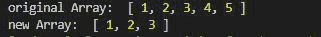
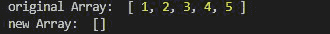
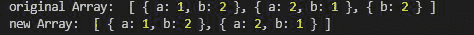

# 洛达什 _。dropRight()功能

> 原文:[https://www.geeksforgeeks.org/lodash-_-dropright-function/](https://www.geeksforgeeks.org/lodash-_-dropright-function/)

Lodash 是一个工作在下划线之上的 JavaScript 库。Lodash 有助于处理数组、字符串、对象、数字等。
**_。dropRight()** 函数用于删除数组右侧的元素，即第(n-1)个元素。

**语法:**

```
_.dropRight(array, n)
```

**参数:**

*   **数组:**是要删除元素的原始数组。
*   **n:** 这里 n 是要从数组中删除的元素数量。默认情况下，它被设置为 1。

**返回值:**返回数组。

**注意:**在使用下面给出的代码之前，使用命令`npm install lodash`安装 lodash 模块。

**例 1:** 当 n 小于数组的大小时。

```
// Requiring the lodash library
const _ = require("lodash");

// Original array
let array1 = [1, 2, 3, 4, 5]

// Using _.dropRight() function
let newArray = lodash.dropRight(array1, 2);

// Original Array
console.log("original Array: ", array1)

// Printing the newArray
console.log("new Array: ", newArray)
```

**输出:**



**例 2:** 当 n 大于数组的大小时。

```
// Requiring the lodash library
const _ = require("lodash");

// Original array
let array1 = [1, 2, 3, 4, 5]

// Using _.dropRight() function
let newArray = lodash.dropRight(array1, 10);

// Original Array
console.log("original Array: ", array1)

// Printing the newArray
console.log("new Array: ", newArray)
```

**输出:**



**例 3:** 当给定一个对象数组，而没有给定 n。

```
// Requiring the lodash library
const _ = require("lodash");

// Original array
let array1 = [
    { "a": 1, "b": 2 }, 
    { "a": 2, "b": 1 }, 
    { "b": 2 }
]

// Using _.dropRight() function
let newArray = lodash.dropRight(array1);

// Original Array
console.log("original Array: ", array1)

// Printing the newArray
console.log("new Array: ", newArray)
```

**输出:**

