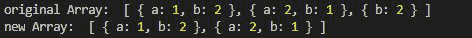
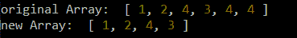

# 洛达什 _。dropRightWhile()功能

> 原文:[https://www . geeksforgeeks . org/lodash-_-drop rightwhile-function/](https://www.geeksforgeeks.org/lodash-_-droprightwhile-function/)

Lodash 是一个工作在下划线之上的 JavaScript 库。Lodash 有助于处理数组、字符串、对象、数字等。
**_。dropRightWhile()** 函数用于删除数组的切片，不包括从末尾删除的元素，直到谓词函数返回 false。

**语法:**

```
_.dropRightWhile(array, [predicate=_.identity])
```

**参数:**

*   **数组:**是要移除元素的数组。
*   **谓词:**它是在数组的每个元素上迭代的函数，并根据给定的条件返回 true 或 false。

**返回:**返回数组。

**注意:**在使用下面给出的代码之前，使用命令`npm install lodash`安装 lodash 模块。

**例 1:**

```
// Requiring the lodash library
const _ = require("lodash");

// Original array
let array1 = [
    { "a": 1, "b": 2 },
    { "a": 2, "b": 1 }, 
    { "b": 2 }
]

// Using _.dropRightWhile() function
let newArray = _.dropRightWhile(array1, (e) => {
    return e.b == 2;
});

// Original Array
console.log("original Array: ", array1)

// Printing the newArray
console.log("new Array: ", newArray)
```

**输出:**



**示例 2:** 在本例中，谓词函数返回 false，它不进一步检查，并返回切片数组。请注意，它不同于从右侧而不是左侧放下元素。

```
// Requiring the lodash library
const _ = require("lodash");

// Original array
let array1 = [1, 2, 4, 3, 4, 4]

// Using _.dropRightWhile() function
let newArray = _.dropRightWhile(array1, (e) => {
    return e == 4;
});

// Original Array
console.log("original Array: ", array1)

// Printing the newArray
console.log("new Array: ", newArray)
```

**输出:**

