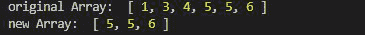
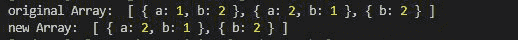

# 洛达什 _。dropWhile()方法

> 原文:[https://www.geeksforgeeks.org/lodash-_-dropwhile-method/](https://www.geeksforgeeks.org/lodash-_-dropwhile-method/)

Lodash 是一个工作在下划线之上的 JavaScript 库。Lodash 有助于处理数组、字符串、对象、数字等。
使用 **Loadsh.dropWhile()** 方法返回给定数组的切片。这需要一个谓词函数，该函数迭代数组的每个元素，如果该函数返回 false，则返回切片数组，不包括从开始处删除的元素。

**语法:**

```
dropWhile(array, [predicate=_.identity])
```

**参数:**

*   **阵:**就是要切片的阵。
*   **谓词:**是根据给定条件返回真或假的函数。

**返回值:**切片后返回新数组。

**注意:**在使用下面给出的代码之前，请使用命令`npm install lodash`安装 lodash 模块。

**例 1:**

## java 描述语言

```
// Requiring the lodash library
const _ = require("lodash");

// Original array
let array1 = [1, 3, 4, 5, 5, 6]

// Using _.dropWhile() method
let newArray = _.dropWhile(array1, (e) => {
    return e != 5;
});

// Original Array
console.log("original Array: ", array1)

// Printing the newArray
console.log("new Array: ", newArray)
```

**输出:**



**例 2:** 给定对象数组时。

## java 描述语言

```
// Requiring the lodash library
const _ = require("lodash");

// Original array
let array1 = [
    { "a": 1, "b": 2 }, 
    { "a": 2, "b": 1 }, 
    { "b": 2 }
]

// Using _.dropWhile() method
let newArray = _.dropWhile(array1, (e) => {
    return e.b == 2;
});

// Original Array
console.log("original Array: ", array1)

// Printing the newArray
console.log("new Array: ", newArray)
```

**输出:**

