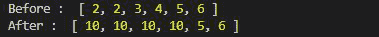
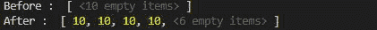
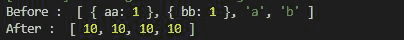

# 洛达什 _。填充()方法

> 原文:[https://www.geeksforgeeks.org/lodash-_-fill-method/](https://www.geeksforgeeks.org/lodash-_-fill-method/)

**Lodash** 是一个工作在下划线. js 之上的库，当它与对象、数组、字典和字符串一起使用时，它被证明非常方便。
lodash . fill()方法用于在给定范围内将一组值填充到数组中。

**语法:**

```
lodash.fill(array, value, startIndex, endIndex)
```

**参数:**

*   **数组:**是要填充一定值的原始数组。
*   **值:**数组中要填充的值。
*   **开始索引:**是要填充值的索引。
*   **endIndex:** 是数组中要填充值的索引。

**注:**

*   除 endIndex 外，所有小于 **endIndex** 的索引都包括在内。
*   更改在原始数组中完成。

**返回值:**返回数组。

**例 1:**

## java 描述语言

```
// Requiring the lodash library
let lodash = require("lodash");

// Original array
let array = [2, 2, 3, 4, 5, 6]

// Printing original array 
console.log("Before : ", array)

// Using fill() method to replace
// values in range (0, 4]
lodash.fill(array, 10, 0, 4)

// Printing original array again 
console.log("After : ", array)
```

**输出:**



**例 2:** 给出空数组时。

## java 描述语言

```
// Requiring the lodash library
let lodash = require("lodash");

// Original array
let array = Array(10)

// Printing original array 
console.log("Before : ", array)

// Using fill() method to add
// values in range (0, 4]
lodash.fill(array, 10, 0, 4)

// Printing original array again 
console.log("After : ", array)
```

**输出:**



**例 3:** 当 endIndex 大于数组的大小时。

## java 描述语言

```
// Requiring the lodash library
let lodash = require("lodash");

// Original array
let array = [{ "aa": 1 }, 
        { "bb": 1 }, "a", "b"]

// Printing original array 
console.log("Before : ", array)

// Using fill() method to replace
// values in range (0, 10] greater
// then size of array
lodash.fill(array, 10, 0, 10)

// Printing original array again 
console.log("After : ", array)
```

**输出:**

