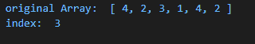
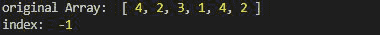

# 洛达什 _。findIndex()方法

> 原文:[https://www.geeksforgeeks.org/lodash-_-findindex-method/](https://www.geeksforgeeks.org/lodash-_-findindex-method/)

Lodash 是 Node.js 中的一个模块，工作在下划线. js 之上。Lodash 有助于处理数组、字符串、对象、数字等。
使用 **Loadsh.findIndex()** 方法查找元素第一次出现的索引。它不同于 indexOf，因为它采用遍历数组每个元素的谓词函数。

**语法:**

```
findIndex(array, [predicate=_.identity], fromIndex)
```

**参数:** 该方法接受三个参数，如上所述，描述如下:

*   **数组:**是要搜索值的数组。
*   **谓词:**是迭代每个元素的函数。
*   **fromIndex:** 是要搜索元素的索引。如果默认情况下未给出 from 索引，则它将为 0。

**返回值:**如果找到则返回元素的索引，否则返回-1。

**注意:**在使用下面给出的代码之前，请使用命令 **npm 安装 lodash** 安装 lodash 模块。

**示例 1:** 当搜索元素时，从索引 0 开始。

## java 描述语言

```
// Requiring the lodash library
const _ = require('lodash');

// Original array
let array1 = [4, 2, 3, 1, 4, 2]

// Using lodash.findIndex
let index = _.findIndex(array1, (e) => {
    return e == 1;
}, 0);

// Print original Array
console.log("original Array: ", array1)

// Printing the index
console.log("index: ", index)
```

**输出:**



**例 2:** 当元素被某个索引“I”后。这里，元素出现在数组中，但输出仍然是-1，因为它出现在索引 3 处，搜索从索引 5 开始。

## java 描述语言

```
// Requiring the lodash library
const _ = require('lodash');

// Original array
let array1 = [4, 2, 3, 1, 4, 2]

// Using lodash.findIndex
let index = _.findIndex(array1, (e) => {
    return e == 1;
}, 5);

// Print original Array
console.log("original Array: ", array1)

// Printing the index
console.log("index: ", index)
```

**输出:**

