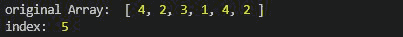
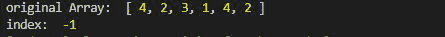
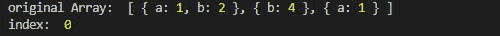

# Lodash _。findLastIndex()函数

> 原文:[https://www . geesforgeks . org/lodash-_-findlastindex-function/](https://www.geeksforgeeks.org/lodash-_-findlastindex-function/)

Lodash 是一个工作在下划线之上的 JavaScript 库。Lodash 有助于处理数组、字符串、对象、数字等。
**_。函数的作用是:从数组的右边找到元素。因此给出数组中元素最后一次出现的索引。**

**语法:**

```
findLastIndex(array, [predicate=_.identity], fromIndex);

```

**参数:**

*   **阵:**是原阵。
*   **谓词:**是迭代每个元素的函数。
*   **fromIndex:** 是搜索开始后的索引。如果没有给出从索引，那么默认情况下它是 n-1，其中 n 是数组的长度。

**返回值:**如果找到则返回元素的索引，否则返回-1。

**注意:**在使用下面给出的代码之前，使用命令`npm install lodash`安装 lodash 模块。

**例 1:**

```
// Requiring the lodash library
const _ = require("lodash");

// Original array
let array1 = [4, 2, 3, 1, 4, 2]

// Using lodash.findLastIndex
let index = _.findLastIndex(array1, (e) => {
    return e == 2;
});

// Original Array
console.log("original Array: ", array1)

// Printing the index
console.log("index: ", index)
```

**输出:**



**示例 2:** 当数组中存在一个元素，但输出为-1，因为它出现在来自索引的之后。这里 fromIndex 是 2。

```
// Requiring the lodash library
const _ = require("lodash");

// Original array
let array1 = [4, 2, 3, 1, 4, 2]

// Using lodash.findLastIndex
let index = _.findLastIndex(array1, (e) => {
    return e == 1;
}, 2);

// Original Array
console.log("original Array: ", array1)

// Printing the index
console.log("index: ", index)
```

**输出:**



**例 3:** 当给定一组对象时。

```
// Requiring the lodash library
const _ = require("lodash");

// Original array
let array1 = [
    { "a": 1, "b": 2 }, 
    { "b": 4 }, 
    { "a": 1 }
]

// Using lodash.findLastIndex
let index = lodash.findLastIndex(array1, (e) => {
    return e.b == 2;
}, 2);

// Original Array
console.log("original Array: ", array1)

// Printing the index
console.log("index: ", index)
```

**输出:**

