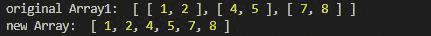
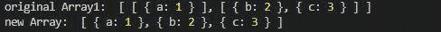
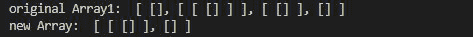

# 洛达什 _。压平()方法

> 原文:[https://www.geeksforgeeks.org/lodash-_-flatten-method/](https://www.geeksforgeeks.org/lodash-_-flatten-method/)

Lodash 是一个工作在下划线之上的 JavaScript 库。Lodash 有助于处理数组、字符串、对象、数字等。
使用**lodash . flat()**方法将数组展平一级深。

**语法:**

```
flatten( array )
```

**参数:**此方法接受单参数**数组**，保存简单数组或数组数组数组。

**返回值:**该函数的返回类型为数组。

**注意:**在使用下面给出的代码之前，请使用命令`npm install lodash`安装 lodash 模块。

**例 1:** 当给出 2D 整数数组时。

## java 描述语言

```
// Requiring the lodash library
const _ = require("lodash");

// Original array
let array1 = [[1, 2], [4, 5], [7, 8]]

// Using _.flatten() method
let newArray = _.flatten(array1);

// Printing original Array
console.log("original Array1: ", array1)

// Printing the newArray
console.log("new Array: ", newArray)
```

**输出:**



**例 2:** 当给定对象数组的数组时。

## java 描述语言

```
// Requiring the lodash library
const _ = require("lodash");

// Original array
let array1 = [[{ "a": 1 }], 
    [{ "b": 2 }, { "c": 3 }]]

// using _.flatten() method
let newArray = _.flatten(array1);

// printing original Array
console.log("original Array1: ", array1)

// printing the newArray
console.log("new Array: ", newArray)
```

**输出:**



**例 3:** 给定数组的空数组时。

## java 描述语言

```
// Requiring the lodash library
const _ = require("lodash");

// Original array
let array1 = [[], [[[]]], [[]], []]

// Using _.flatten() method
let newArray = lodash.flatten(array1);

// Printing original Array
console.log("original Array1: ", array1)

// Printing the newArray
console.log("new Array: ", newArray)
```

**输出:**

