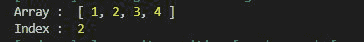
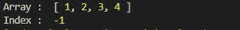

# 洛达什 _。indexOf()方法

> 原文:[https://www.geeksforgeeks.org/lodash-_-indexof-method/](https://www.geeksforgeeks.org/lodash-_-indexof-method/)

洛达什 **_。indexOf()** 方法用于获取数组中特定元素第一次出现的索引。如果数组中不存在 fromIndex，则输出负一，并且不显示任何错误。

**语法:**

```
indexOf(array, value, fromIndex)
```

**注意:**如果数组中找不到该值 **-1** 返回。

**参数:**该方法接受三个参数，如上所述，如下所述。

*   **数组:**是要在其中查找值的数组。
*   **值:**是数组中要查找的值。
*   **fromIndex:** 就是这个指数，之后我们要寻找这个值。

**返回值:**返回数组中值的索引。如果找不到该值，数组返回-1。

**例 1:**

## java 描述语言

```
// Requiring the lodash library
const _= require("lodash");

// Original array
let array = [1,2,3,4]

// Printing original array 
console.log("Array : ",array)

// Looking for value 3 from index 0 
let index = _.indexOf(array,3,0)

// Printing the Index of the value 
console.log("Index : ",index)
```

**输出:**



**示例 2:** 从特定索引中查找值。

## java 描述语言

```
// Requiring the lodash library
const _ = require("lodash");

// Original array
let array = [1,2,3,4]

// Printing original array 
console.log("Array : ",array)

// Looking for 3 from index 3 
// it will return -1
let index = _.indexOf(array,3,3)

// Print Index of the value 
console.log("Index : ",index)
```

**输出:**

