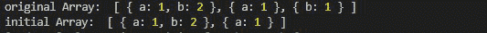
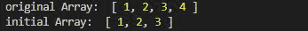
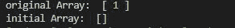

# 洛达什 _。初始()功能

> 原文:[https://www.geeksforgeeks.org/lodash-_-initial-function/](https://www.geeksforgeeks.org/lodash-_-initial-function/)

**Lodash** 是一个工作在下划线. js 之上的 JavaScript 库，Lodash 有助于处理数组、字符串、对象、数字等。
函数用于获取数组中 0 到 n-2 范围内的所有元素。从而得到除第(n-1)个元素以外的所有元素。

**语法:**

```
Lodash.initial( arrayObject )
```

**参数:**

*   **数组对象:**数组类型只有一个参数。

**返回值:**返回一个数组对象。

**注意:**在使用下面给出的代码之前，先通过`npm install lodash`安装 lodash 模块。

**例 1:** 当给定一组对象时。

```
// Requiring the lodash library
const _ = require("lodash");

// Original array
let array1 = [
    { "a": 1, "b": 2 }, 
    { "a": 1 }, 
    { "b": 1 }
]

// Using _.initial() function to get 
// all elements of the array in 
// range (0,n-2])
let initialArray = lodash.initial(array1);

// Original Array
console.log("original Array: ", array1)

// Printing the initialArray
console.log("initial Array: ", initialArray)
```

**输出:**



**例 2:**

```
// Requiring the lodash library
const _ = require("lodash");

// Original array
let array1 = [1, 2, 3, 4]

// Using _.initial() function to
// get all elements of the array
// in range (0,n-2])
let initialArray = lodash.initial(array1);

// Original Array
console.log("original Array: ", array1)

// Printing the initialArray
console.log("initial Array: ", initialArray)
```

**输出:**



**示例 3:** 当给定一个大小为 1 的数组时，它返回空数组。

```
// Requiring the lodash library
const _ = require("lodash");

// Original array
let array1 = [1]

// Using _.initial() function to
// get all elements of the array
// in range (0,n-2])
let initialArray = lodash.initial(array1);

// Original Array
console.log("original Array: ", array1)

// Printing the initialArray
console.log("initial Array: ", initialArray)
```

**输出:**

