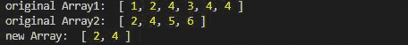
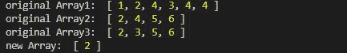
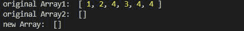

# 洛达什 _。交点()法

> 原文:[https://www.geeksforgeeks.org/lodash-_-intersection-method/](https://www.geeksforgeeks.org/lodash-_-intersection-method/)

Lodash 是一个工作在下划线之上的 JavaScript 库。Lodash 有助于处理数组、字符串、对象、数字等。
**_。交集()**方法用于获取一个或多个数组的交集。和集合论中的交集一样。

**语法:**

```
_.intersection([arrays])
```

**参数:**它以数组为参数。

**返回值:**返回数组交集后的数组。

**注意:**在使用下面给出的代码之前，请使用命令`npm install lodash`安装 lodash 模块。

**例 1:** 取两个数组的交集。

## java 描述语言

```
// Requiring the lodash library
const _ = require("lodash");

// Original array
let array1 = [1, 2, 4, 3, 4, 4]
let array2 = [2, 4, 5, 6]

// Using _.intersection() method
let newArray = lodash.intersection(
                array1, array2);

// Printing original Array
console.log("original Array1: ", array1)
console.log("original Array2: ", array2)

// Printing the newArray
console.log("new Array: ", newArray)
```

**输出:**



**例 2:** 取两个以上数组的交集。

## java 描述语言

```
// Requiring the lodash library
const _ = require("lodash");

// Original array
let array1 = [1, 2, 4, 3, 4, 4]
let array2 = [2, 4, 5, 6]
let array3 = [2, 3, 5, 6]

// Using _.intersection() method
let newArray = _.intersection(
        array1, array2, array3);

// Printing original Array
console.log("original Array1: ", array1)
console.log("original Array2: ", array2)
console.log("original Array3: ", array3)

// Printing the newArray
console.log("new Array: ", newArray)
```

**输出:**



**例 3:** 数组与空数组的交集。

## java 描述语言

```
// Requiring the lodash library
const _ = require("lodash");

// Original array
let array1 = [1, 2, 4, 3, 4, 4]
let array2 = []

// Using _.intersection() method
let newArray = lodash
    .intersection(array1, array2);

// Printing original Array
console.log("original Array1: ", array1)
console.log("original Array2: ", array2)

// Printing the newArray
console.log("new Array: ", newArray) 
```

**输出:**

