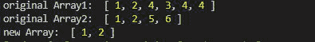
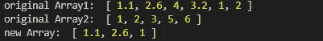
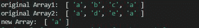

# 洛达什 _。相交 By()方法

> 原文:[https://www . geesforgeks . org/lo dash-_-intersection by-method/](https://www.geeksforgeeks.org/lodash-_-intersectionby-method/)

**Lodash** 是一个工作在下划线. js 之上的 JavaScript 库，Lodash 有助于处理数组、字符串、对象、数字等。
国 **_。intersectionBy()** 用于根据在数组的每个元素上迭代的某个函数，获取数组与任意数量的数组的交集。它在数组相交后返回数组。

**语法:**

```
_.intersectionBy([arrays], [iteratee=_.identity])
```

**参数:**

*   **数组:**就是要取交集的数组。
*   **迭代=_。identity:** 它是迭代数组中要取交集的每个元素的函数。

**返回值:**返回交集后的数组，不重复。

**注意:**在使用下面给出的代码之前，请通过`npm install lodash`安装 lodash 模块。

**示例 1:** 当迭代函数未给出时，它的行为与 lodash 的交集()函数相同。

## java 描述语言

```
// Requiring the lodash library
const _ = require("lodash");

// Original arrays
let array1 = [1, 2, 4, 3, 4, 4]
let array2 = [1, 2, 5, 6]

// Using _.intersectionBy() method
let newArray = _.intersectionBy(array1, array2);

// Printing original Array
console.log("original Array1: ", array1)
console.log("original Array2: ", array2)

// Printing the newArray after intersection
console.log("new Array: ", newArray) 
```

**输出:**



**示例 2:** 当使用 Math.ceil()函数在数组 1 上运行时，将数组 1 的所有值与下一个最近的较大整数进行比较，然后取交集。

## java 描述语言

```
// Requiring the lodash library
const _ = require("lodash");

// Original array and array1 
// float values are given
let array1 = [1.1, 2.6, 4, 3.2, 1, 2]
let array2 = [1, 2, 3, 5, 6]

// Using _.intersection() method
// when this function is run array1
// looks like array1=[2, 3, 4, 4, 1, 2]
// after that intersection is taken
let newArray = lodash.intersectionBy(
        array1, array2, Math.ceil);

// Printing original Array
console.log("original Array1: ", array1)
console.log("original Array2: ", array2)

// Printing the newArray
console.log("new Array: ", newArray)
```

**输出:**



**示例 3:** 当存在多个公共元素时，它只返回它们一次，并且在数组中不返回重复的元素。

## java 描述语言

```
// Requiring the lodash library
const _ = require("lodash");

// Original array
let array1 = ["a", "b", "c", "a"]
let array2 = ["a", "d", "e", "a"]

// Using _.intersection() method
let newArray = lodash.intersectionBy(
        array1, array2, "a");

// Printing original Array
console.log("original Array1: ", array1)
console.log("original Array2: ", array2)

// Printing the newArray
console.log("new Array: ", newArray)
```

**输出:**

