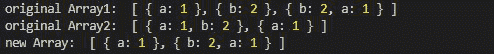
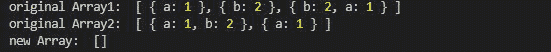

# 洛达什 _。与()方法相交

> 原文:[https://www . geesforgeks . org/lo dash-_-intersection with-method/](https://www.geeksforgeeks.org/lodash-_-intersectionwith-method/)

Lodash 是一个工作在下划线之上的 JavaScript 库。Lodash 有助于处理数组、字符串、对象、数字等。
**_。intersectionwith()** 方法用于获取一个或多个数组的交集。它与 lodash 中的交集函数相同，唯一的区别是它接受一个比较器，调用该比较器来比较数组的元素。

**语法:**

```
intersectionWith([arrays], [comparator])
```

**参数:**该方法接受如上所述的两个参数，描述如下:

*   **数组:**它以数组为参数。
*   **比较器:**它是对数组的每个值进行迭代并将这些值与给定的比较器函数进行比较的函数。

**返回值:**返回数组交集后的数组。

**注意:**在使用下面给出的代码之前，请使用命令 **npm 安装 lodash** 安装 lodash 模块。

**例 1:**

## java 描述语言

```
// Requiring the lodash library
const _ = require("lodash");

// Original array
let array1 = [
    { "a": 1 }, { "b": 2 },
    { "b": 2, "a": 1 }
]

let array2 = [
    { "a": 1, "b": 2 },
    { "a": 1 }
]

// Using _.intersectionWith() method
let newArray = _.intersectionWith(
    array1, array2, _.isEqual);

// Printing original Array
console.log("original Array1: ", array1)
console.log("original Array2: ", array2)

// Printing the newArray
console.log("new Array: ", newArray)
```

**输出:**



**例 2:** 不使用比较器功能时即 _。isequal()则输出为空数组。

## java 描述语言

```
// Requiring the lodash library
const _ = require("lodash");

// Original array
let array1 = [
    { "a": 1 }, { "b": 2 },
    { "b": 2, "a": 1 }
]

let array2 = [
    { "a": 1, "b": 2 },
    { "a": 1 }
]

// Using _.intersectionWith() method
// and no comparator function
let newArray = _.intersectionWith(
    array1, array2);

// Printing original Array
console.log("original Array1: ", array1)
console.log("original Array2: ", array2)

// Printing the newArray
console.log("new Array: ", newArray)
```

**输出:**

