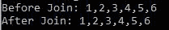
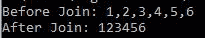

# 洛达什 _。join()方法

> 原文:[https://www.geeksforgeeks.org/lodash-_-join-method/](https://www.geeksforgeeks.org/lodash-_-join-method/)

**_。join()函数**用于将数组中的所有元素转换为由分隔符分隔的字符串。

**语法:**

```
_.join(array, [separator=','])

```

**参数:**该方法接受两个参数，如上所述，如下所述:

*   **数组:**是要执行联接操作的原始数组。
*   **分隔符:**分隔数组每个元素的字符串。如果默认情况下保留它，数组元素用逗号(，)分隔。

**返回值:**该函数返回一个字符串，该字符串是通过使用分隔符连接数组的所有元素而创建的。

**注意:**在使用下面给出的代码之前，通过使用命令 npm 安装 lodash 来安装 lodash 模块。

**示例 1:** 在本例中，函数 join()使用 **'|'** 将数组的元素连接到一个字符串中。

## java 描述语言

```
// Requiring the lodash library 
let lodash = require("lodash"); 

// Original array to be joined 
let array = [ 1, 2, 3, 4, 5, 6 ]; 

let newArray = lodash.join(array, '|'); 
console.log("Before Join: " + array); 

// Printing newArray  
console.log("After Join: " + newArray);
```

**输出:**


**示例 2:** 在本例中，函数 join()使用**、“**将数组的元素连接到一个字符串中，因为它是默认值。

## java 描述语言

```
// Requiring the lodash library 
let lodash = require("lodash"); 

// Original array to be joined 
let array = [ 1, 2, 3, 4, 5, 6 ]; 

let newArray = lodash.join(array); 
console.log("Before Join: " + array); 

// Printing newArray  
console.log("After Join: " + newArray);
```

**输出:**



**示例 3:** 在本例中，函数 join()使用' '(空字符串)将数组的元素连接在一起形成一个字符串。

## java 描述语言

```
// Requiring the lodash library 
let lodash = require("lodash"); 

// Original array to be joined 
let array = [ 1, 2, 3, 4, 5, 6 ]; 

let newArray = lodash.join(array,''); 
console.log("Before Join: " + array); 

// Printing newArray  
console.log("After Join: " + newArray);
```

**输出:**

