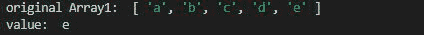
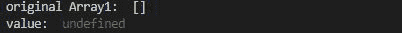

# 洛达什 _。最后()方法

> 原文:[https://www.geeksforgeeks.org/lodash-_-last-method/](https://www.geeksforgeeks.org/lodash-_-last-method/)

**Lodash** 是一个在下划线. js 之上工作的 JavaScript 库，Lodash 有助于处理数组、字符串、对象、数字等。 **_。last()** 方法用于获取数组的最后一个元素，即第(n-1)个元素。

**语法:**

```
lodash.last( array )
```

**参数:**该函数接受单个参数，即数组。

**返回值:**返回数组的最后一个元素。

**注意:**请在使用下面给出的代码之前，通过 **npm 安装 lodash 模块**。

**例 1:**

## java 描述语言

```
// Requiring the lodash library
const _ = require("lodash");

// Original array
let array1 = ["a", "b", "c", "d", "e"]

// Using _.last() method
let value = _.last(array1);

// Printing original Array
console.log("original Array1: ", array1)

// Printing the value
console.log("value: ", value)
```

**输出:**



**例 2:**

## java 描述语言

```
// Requiring the lodash library
const _ = require("lodash");

// Original array
let array1 = []

// Using _.last() method
let value = _.last(array1);

// Printing original Array
console.log("original Array1: ", array1)

// Printing the value
console.log("value: ", value)
```

**输出:**

