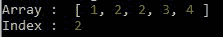
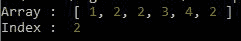
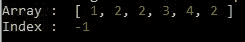

# Lodash _.lastIndexOf（） 方法

> 原文:[https://www.geeksforgeeks.org/lodash-_-lastindexof-method/](https://www.geeksforgeeks.org/lodash-_-lastindexof-method/)

洛达什 **_。indexOf()** 方法用于从最后一个元素获取数组中特定元素第一次出现的索引。如果数组中不存在 fromIndex，则输出负一，并且不显示任何错误。这个方法就像[洛达什 _。](https://www.geeksforgeeks.org/lodash-_-indexof-method/)的索引，除了它从右向左迭代数组的元素。

**语法:**

```
_.lastIndexOf(array, value, [fromIndex=array.length-1])

```

**注意:**如果在数组中找不到该值，则返回-1。

**参数:**该方法接受三个参数，如上所述，如下所述。

*   **数组:**是要在其中查找值的数组。
*   **值:**是数组中要查找的值。
*   **fromIndex:** 就是这个指数，之后我们要寻找这个值。

**返回值:**返回数组中值的索引。如果找不到该值，数组返回-1。

**例 1:**

## java 描述语言

```
// Requiring the lodash library 
const _= require("lodash"); 

// Original array 
let array = [1, 2, 2, 3, 4] 

// Printing original array  
console.log("Array : ",array) 

// Looking for value 3 from Last index   
let index = _.lastIndexOf(array,2) 

// Printing the Index of the value  
console.log("Index : ",index)
```

**输出:**



**示例 2:** 从特定索引中查找值。

## java 描述语言

```
// Requiring the lodash library 
const _= require("lodash"); 

// Original array 
let array = [1, 2, 2, 3, 4, 2] 

// Printing original array  
console.log("Array : ",array) 

// Looking for value 3 from Last index   
let index = _.lastIndexOf(array,2,2) 

// Printing the Index of the value  
console.log("Index : ",index)
```

**输出:**



**示例 3:** 寻找不存在的值。

## java 描述语言

```
// Requiring the lodash library 
const _= require("lodash"); 

// Original array 
let array = [1, 2, 2, 3, 4, 2] 

// Printing original array  
console.log("Array : ",array) 

// Looking for value 3 from Last index   
let index = _.lastIndexOf(array,4,2) 

// Printing the Index of the value  
console.log("Index : ",index)
```

**输出:**

