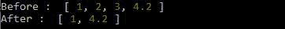
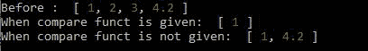

# 洛达什 _。普拉尔比()方法

> 原文:[https://www.geeksforgeeks.org/lodash-_-pullallby-method/](https://www.geeksforgeeks.org/lodash-_-pullallby-method/)

**_。方法用于通过使用迭代函数迭代数组中的每个元素来从原始数组中移除值。几乎和 _。pullAll()函数。**

**语法:**

```
_.pullAllBy(array, values, [iteratee=_.identity])
```

**参数:**该方法接受两个参数，如上所述，如下所述:

*   **数组:**此参数保存需要修改的数组。
*   **值:**此参数保存需要从第一个数组中移除的数组中的值。
*   **迭代:**这是迭代每个元素的函数。

**返回值:**返回一个数组。

**注意:**如果没有给出迭代函数，那么 _。函数充当 _。pullAll()函数。

**例 1:**

## java 描述语言

```
// Requiring the lodash library
const _ = require("lodash");

// Original array
let array1 = [1, 2, 3, 4.2]

// Array to be subtracted
let val = [2, 3, 3, 5]

// Printing the original array
console.log("Before : ", array1); 

// Array after _.pullAllBy() 
// method where Math.double is the
// comparable function
_.pullAllBy(array1, val, Math.double);

// Printing the output
console.log("After : ", array1);
```

**输出:**



**例 2:**

## java 描述语言

```
// Requiring the lodash library
const _ = require("lodash");

// Original array
let array1 = [1, 2, 3, 4.2]
let array2 = [1, 2, 3, 4.2]

// Value array to be subtracted
let val = [2, 3, 4, 5]

// Printing the original array
console.log("Before : ", array1);

// Array after _.pullAllBy()
// method where Math.double is the
// comparable function
_.pullAllBy(
    array1, val, Math.floor);

// Array after _.pullAllBy function
// where no comparable function is given
 _.pullAllBy(array2, val); 

// Printing the output
console.log("When compare funct is given: ", 
        array1);

// Printing the output
console.log("When compare funct is not given: ", 
        array2);
```

**输出:**



**注意:**这在正常的 JavaScript 中不会起作用，因为它需要安装库 lodash。