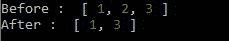
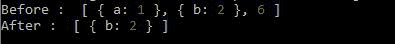

# 洛达什 _。拉动带()方法

> 原文:[https://www.geeksforgeeks.org/lodash-_-pullallwith-method/](https://www.geeksforgeeks.org/lodash-_-pullallwith-method/)

**_。pullAllWith()** 方法类似于 _。pullAll()方法，返回包含第一个数组中的值的第一个数组，这些值不在第二个数组中，而是在 _ 中。通过应用第三个数组中提供的比较，将第一个数组的所有元素与第二个数组进行比较。读这个可能会有点复杂，但是当你看到这个例子的时候就会变得简单了。

**语法:**

```
_.pullAllWith(array, values, [comparator])

```

**参数:**该方法接受三个参数，如上所述，如下所述:

*   **数组:**此参数保存需要修改的数组。
*   **值:**该参数保存需要删除的值。
*   **比较器:**该参数保存每个元素调用的比较。

**返回值:**这个方法返回一个数组。

**示例 1:** 这里，const _ = require('lodash ')用于将 lodash 库导入文件。

## java 描述语言

```
// Requiring the lodash library 
const _ = require("lodash"); 

// Original array 
let x = [1, 2, 3] 

// Value array to be subtracted 
let y = [2, 4, 5] 

// Printing the original array 
console.log("Before : ", x);

// Array after _.pullAllWith() 
// method where _.isEqual is the 
// comparator
_.pullAllWith(x, y, _.isEqual);

// Printing the output 
console.log("After : ",x);
```

**输出:**



**例 2:**

## java 描述语言

```
// Requiring the lodash library 
const _ = require("lodash"); 

// Original array 
let x = [{a: 1}, {b: 2}, 6]  

// Value array to be subtracted 
let y = [{a: 1}, 7, 6] 

// Printing the original array 
console.log("Before : ", x);

// Array after _.pullAllWith() 
// method where _.isEqual is the 
// comparator
_.pullAllWith(x, y, _.isEqual);

// Printing the output 
console.log("After : ",x);
```

**输出:**

