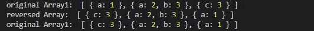

# 洛达什 _。反向()功能

> 原文:[https://www.geeksforgeeks.org/lodash-_-reverse-function/](https://www.geeksforgeeks.org/lodash-_-reverse-function/)

**Lodash** 是一个工作在下划线. js 之上的 JavaScript 库，Lodash 有助于处理数组、字符串、对象、数字等。
国 **_。**reverse()用于反转阵列。这个函数改变了原来的数组，也返回了一个新的数组。

**语法:**

```
_.reverse( array )
```

**参数:**该函数接受保存元素数组的单参数**数组**。

**返回值:**返回反转后的数组。

**注意:**在使用下面给出的代码之前，请使用`npm install lodash`安装 lodash 模块。

**例 1:** 这个例子说明了这个函数对原始数组的影响。

## java 描述语言

```
// Requiring the lodash library
const _ = require("lodash");

// Original array
let array1 = [1, 2, 3, 4]

// Printing original Array
console.log("original Array1: ", array1)

// Using _.reverse() method
let reversedArray = _.reverse(array1);

// Printing the reversedArray
console.log("reversed Array: ", reversedArray)

// Printing original Array
console.log("original Array1: ", array1)
```

**输出:**


**示例 2:** 在本例中，我们将取一个对象数组并反转它们。

## java 描述语言

```
// Requiring the lodash library
const _ = require("lodash");

// Original array
let array1 = [
    { "a": 1 }, 
    { "a": 2, "b": 3 }, 
    { "c": 3 }
]

// Printing original Array
console.log("original Array1: ", array1)

// Using _.reverse() method
let reversedArray = _.reverse(array1);

// Printing the reversedArray
console.log("reversed Array: ", reversedArray)

// Printing original Array
console.log("original Array1: ", array1)
```

**输出:**

