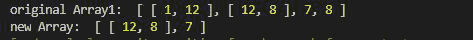
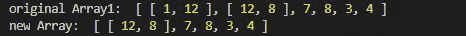
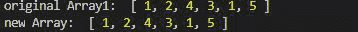

# 洛达什 _。切片()功能

> 原文:[https://www.geeksforgeeks.org/lodash-_-slice-function/](https://www.geeksforgeeks.org/lodash-_-slice-function/)

**Lodash** 是 Node.js 中的一个模块，工作在下划线. js 之上，Lodash 帮助处理数组、字符串、对象、数字等。
使用 **Lodash.slice()** 函数从开始索引到结束索引对数组进行切片，这里结束索引是独占的，开始索引是包含的。

**语法:**

```
_.slice(array, startIndex, endIndex)

```

**参数:**

*   **数组:**是要取切片的数组。
*   **startIndex:** 是数组切片开始的起始索引。
*   **endIndex:** 它是完成切片的结束索引。请注意 endIndex 是独占的。

**返回值:**返回数组的切片，返回类型为数组。

**注意:**请在使用下面给出的代码之前，通过 **npm 安装 lodash 模块**。

**示例 1:** 切片数组，给定的索引大小在数组大小的范围内。

## java 描述语言

```
// Requiring the lodash library
let lodash= require("lodash");

// Original array
let array1 = [[1, 12], [12, 8], 7, 8]

// Using lodash.slice() method
let newArray = lodash.slice(array1, 1, 3);

// Printing original Array
console.log("original Array1: ",array1)

// Printing the newArray
console.log("new Array: ", newArray)
```

**输出:**



**例 2:** 切片数组，给定的结束索引不在数组大小范围内。

## java 描述语言

```
// Requiring the lodash library
let lodash= require("lodash");

// Original array
let array1 = [[1, 12], [12, 8], 7, 8, 3, 4]

// Using lodash.slice() method
let newArray = lodash.slice(array1, 1, 10);

// Printing original Array
console.log("original Array1: ", array1)

// Printing the newArray
console.log("new Array: ", newArray)
```

**输出:**



**例 3:**
切空阵

## java 描述语言

```
// Requiring the lodash library
let lodash = require("lodash");

// Original array
let array1 = []

// Using lodash.slice() method
let newArray = lodash.slice(array1, 1, 2);

// Printing original Array
console.log("original Array1: ", array1)

// Printing the newArray
console.log("new Array: ", newArray)
```

**输出:**


**例 4:** 未给出起始和结束索引时。

## java 描述语言

```
// Requiring the lodash library
let lodash = require("lodash");

// Original array
let array1 = [1, 2, 4, 3, 1, 5]

// Using lodash.slice() method
let newArray = lodash.slice(array1);

// Printing original Array
console.log("original Array1: ", array1)

// Printing the newArray
console.log("new Array: ", newArray)
```

**输出:**

