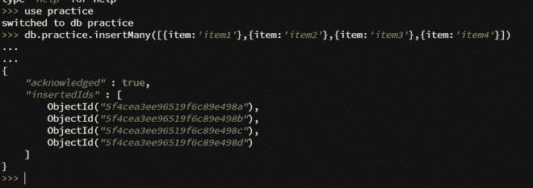
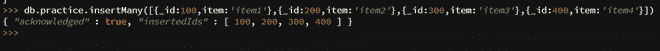
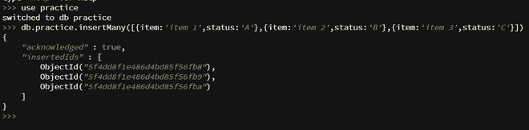
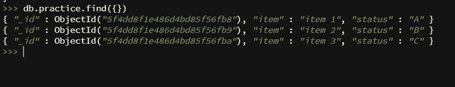
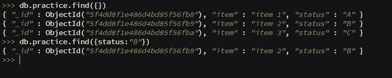
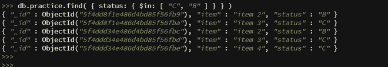
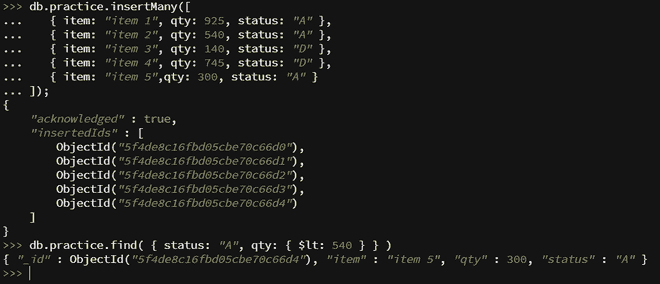
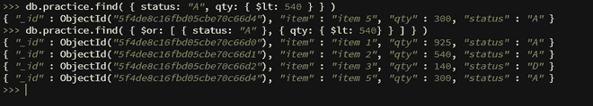
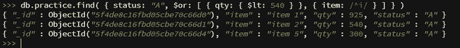

# 在 MongoDB 中添加和查询数据

> 原文:[https://www . geesforgeks . org/添加和查询 mongodb 中的数据/](https://www.geeksforgeeks.org/adding-and-querying-the-data-in-mongodb/)

**在 MongoDB 中添加数据:** MongoDB 在 BSON 存储文档，这是 JSON (JavaScript 对象符号)的二进制形式。这些文件收藏起来了。

**要在 MongoDB 中插入文档，请执行以下步骤:**

**第一步:创建集合**
**语法:**

```
use collection_name

```

如果集合不存在，它将创建一个集合，否则它将返回现有集合。


创建收藏

要显示当前选择的集合，请使用如下所示的“db”命令:


当前选择的收藏

**第二步:将数据插入集合**MongoDB 中的文档可以通过两种方法插入:

1.  **db.collection_name.insertOne():** The db.collection_name.insertOne method is used to insert single document in collection.

    **语法:**

    ```
    db.collection_name.insertOne(item:'item1'}) // OR
    db.collection_name.insert(item:'item1'})

    ```

    **示例:**

    

    插入没有 _id 字段的文档

    在这里，我们可以指定 _id 字段，如果它没有指定，那么 MongoDB 会添加值为 objectId 的 _id 字段。

    

    插入带有 _id 字段的文档

2.  **db.collection_name.insertMany():** The db.collection_name.insertMany() can insert multiple documents into a collection.Only you need to pass array of documents to this method.

    **语法:**

    ```
    db.collection_name.insertMany([{item:'item1'}, {item:'item2'}, 
    {item:'item3'}, {item:'item4'}]) 

    ```

    **示例 1:** 插入多个没有 _id 的文档

    

    插入多个没有 _id 的文档

    **示例 2:** 插入多个 _id 为
    的文档

    

    使用 _id 插入多个文档

**在 MongoDB 中查询数据:**查询操作使用 MongoDB 中的 db.collection.find()方法执行。要在 MongoDB 中查询文档，请执行以下步骤:

**步骤 1:使用 Mongo Shell**
创建收藏并插入文档



在集合中插入文档

**第二步:选择集合中的所有文档–**要选择集合中的所有文档，将一个空文档作为查询过滤参数传递给 find 方法。这个语句类似于 MySQL 中的 SELECT * FROM 表语句。

**语法:**

```
db.collection_name.find({})

```



选择集合中的所有文档

**第三步:指定相等条件–**要过滤 db.collection_name.find()方法的结果，需要为方法指定条件。

**语法:**

```
db.collection_name.find({ <field1>: <value1>, ... })

```



指定相等条件

**第四步:使用查询运算符指定条件–**查询过滤文档可以使用查询运算符指定条件。

**语法:**

```
db.collection_name.find({ <field1>: { <operator1>: <value1> }, ... })

```

1.  **' in ' Operator($ in)–**以下示例检索状态值为“C”或“B”的所有文档。
    

    使用“在”运算符指定条件

    T7】
2.  **‘AND’ Operator(, ) –** A compound query can specify conditions for more than one field in the collection’s documents. Implicitly, a logical AND conjunction connects the clauses of a compound query so that the query selects the documents in the collection that match all the conditions.

    以下示例返回状态为“A”且数量小于 540 的文档。

    

    “与”运算符

3.  **‘OR’ Operator ($or) –** Using the $or operator, you can specify a compound query that joins each clause with a logical OR conjunction so that the query selects the documents in the collection that match at least one condition.

    以下示例返回状态为“A”或数量小于 540 的文档。

    

    “或”运算符($or)

    您可以同时使用“与”和“或”运算符，在以下示例中，查询返回状态等于“A”并且数量小于 540 或项目以字符“I”开头的文档。

    

    同时使用“与”和“或”