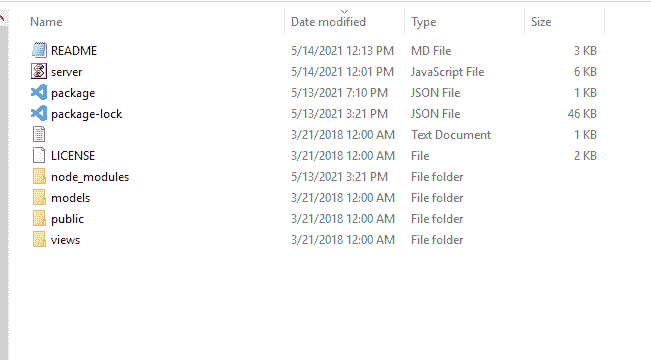
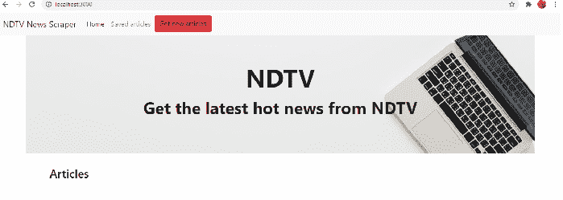
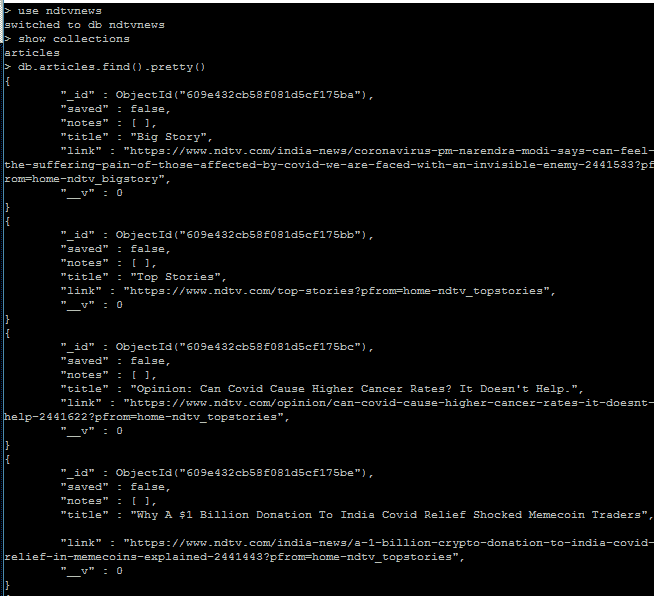
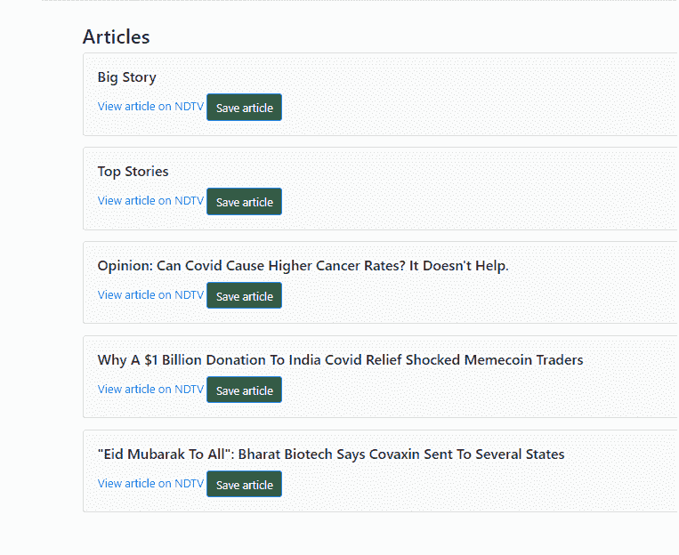

# 使用 MongoDB

创建简讯来源数据

> 原文:[https://www . geeksforgeeks . org/create-a-简讯-采购-数据-使用-mongodb/](https://www.geeksforgeeks.org/create-a-newsletter-sourcing-data-using-mongodb/)

有很多新闻发布网站，比如[ndtv.com](https://www.ndtv.com)。在这篇文章中，让我们看看如何通过抓取特性从 ndtv.com 获取数据的非常有用和有趣的特性，即从 ndtv.com 提取内容并将其存储到 MongoDB 中。MongoDB 是一个 NoSQL documentum 模型数据库。

利用 Mongoose、Node JS、Cheerio，对 NDTV 新闻网站进行抓取，并将数据加载到 Mongo DB 数据库中。这是一个使用 MongoDB、Mongoose、Node.js、Express.js、Handlebars.js、HTML 和 CSS 构建的全栈 JavaScript 应用程序。它抓取[NDTV](https://ndtv.com/)主页并存储文章标题和链接。

**模块安装:**使用以下命令安装所需的模块。

```
npm install body-parser
npm install cheerio
npm install express
npm install express-handlebars
npm install mongoose
npm install request
```

**项目结构:**会是这样的。



### 实施:

**文件名:server.js:** 这是启动应用运行所需的重要文件。要调用 ndtv 站点，刮取数据，并将其存储在 MongoDB 数据库中。

## java 描述语言

```
// First specifying the required dependencies
// Express is a minimal and flexible Node.js
// web application framework that provides a 
// robust set of features for web and mobile 
// applications
var express = require("express");

// To communicate with mongodb, we require "mongoose"
var mongoose = require("mongoose");

// As we need to call ndtv website and access
// the urls, we require "request"
var request = require("request");

// Cheerio parses markup and provides an 
// API for traversing/manipulating the
// resulting data structure
var cheerio = require("cheerio");

// Node.js body parsing middleware.
// Parse incoming request bodies in a
// middleware before your handlers, 
// available under the req.body property.
var bodyParser = require("body-parser");
var exphbs = require("express-handlebars");

// We can explicitly set the port number
// provided no other instances running 
// on that port
var PORT = process.env.PORT || 3000;

// Initialize Express
var app = express();

// Use body-parser for handling form submissions
app.use(bodyParser.urlencoded({
    extended: false
}));

// We are getting the output in the
// form of application/json
app.use(bodyParser.json({
    type: "application/json"
}));

// Serve the public directory
app.use(express.static("public"));

// Use promises with Mongo and connect to
// the database
// Let us have our mongodb database name
// to be ndtvnews By using Promise, 
// Mongoose async operations, like .save()
// and queries, return thenables. 
mongoose.Promise = Promise;
var MONGODB_URI = process.env.MONGODB_URI 
        || "mongodb://localhost/ndtvnews";

mongoose.connect(MONGODB_URI);

// Use handlebars
app.engine("handlebars", exphbs({
    defaultLayout: "main"
}));

app.set("view engine", "handlebars");

// Hook mongojs configuration to the db variable
var db = require("./models");

// We need to filter out NdtvArticles from
// the database that are not saved
// It will be called on startup of url
app.get("/", function (req, res) {

    db.Article.find({
        saved: false
    },
        function (error, dbArticle) {
            if (error) {
                console.log(error);
            } else {

                // We are passing the contents
                // to index.handlebars
                res.render("index", {
                    articles: dbArticle
                });
            }
        })
})

// Use cheerio to scrape stories from NDTV
// and store them
// We need to do this on one time basis each day
app.get("/scrape", function (req, res) {
    request("https://ndtv.com/", function (error, response, html) {

        // Load the html body from request into cheerio
        var $ = cheerio.load(html);

        // By inspecting the web page we know how to get the 
        // title i.e. headlines of news.
        // From view page source also we can able to get it. 
        // It differs in each web page
        $("h2").each(function (i, element) {

            // The trim() removes whitespace because the 
            // items return \n and \t before and after the text
            var title = $(element).find("a").text().trim();
            console.log("title", title);
            var link = $(element).find("a").attr("href");
            console.log("link", link);

            // If these are present in the scraped data, 
            // create an article in the database collection
            if (title && link) {
                db.Article.create({
                    title: title,
                    link: link
                },
                    function (err, inserted) {
                        if (err) {

                            // Log the error if one is 
                            // encountered during the query
                            console.log(err);
                        } else {

                            // Otherwise, log the inserted data
                            console.log(inserted);
                        }
                    });

                // If there are 10 articles, then 
                // return callback to the frontend
                console.log(i);
                if (i === 10) {
                    return res.sendStatus(200);
                }
            }
        });
    });
});

// Route for retrieving all the saved articles. 
// User has the option to save the article.
// Once it is saved, "saved" column in the 
// collection is set to true. 
// Below routine helps to find the articles 
// that are saved
app.get("/saved", function (req, res) {
    db.Article.find({
        saved: true
    })
        .then(function (dbArticle) {

            // If successful, then render with
            // the handlebars saved page
            // this time saved.handlebars is 
            // called and that page is rendered
            res.render("saved", {
                articles: dbArticle
            })
        })
        .catch(function (err) {

            // If an error occurs, send the
            // error back to the client
            res.json(err);
        })
});

// Route for setting an article to saved
// In order to save an article, this routine is used.
// _id column in collection is unique and it will 
// determine the uniqueness of the news
app.put("/saved/:id", function (req, res) {
    db.Article.findByIdAndUpdate(
        req.params.id, {
        $set: req.body
    }, {
        new: true
    })
        .then(function (dbArticle) {

            // This time saved.handlebars is 
            // called and that page is rendered
            res.render("saved", {
                articles: dbArticle
            })
        })
        .catch(function (err) {
            res.json(err);
        });
});

// Route for saving a new note to the db and
// associating it with an article
app.post("/submit/:id", function (req, res) {
    db.Note.create(req.body)
        .then(function (dbNote) {
            var articleIdFromString = 
                mongoose.Types.ObjectId(req.params.id)

            return db.Article.findByIdAndUpdate(
                articleIdFromString, {
                $push: {
                    notes: dbNote._id
                }
            })
        })
        .then(function (dbArticle) {
            res.json(dbNote);
        })
        .catch(function (err) {

            // If an error occurs, send it
            // back to the client
            res.json(err);
        });
});

// Route to find a note by ID
app.get("/notes/article/:id", function (req, res) {
    db.Article.findOne({ "_id": req.params.id })
        .populate("notes")
        .exec(function (error, data) {
            if (error) {
                console.log(error);
            } else {
                res.json(data);
            }
        });
});

app.get("/notes/:id", function (req, res) {
    db.Note.findOneAndRemove({ _id: req.params.id }, 
        function (error, data) {
            if (error) {
                console.log(error);
            }
            res.json(data);
    });
});

// Listen for the routes
app.listen(PORT, function () {
    console.log("App is running");
});
```

**运行应用程序的步骤:**使用以下命令运行 *server.js* 文件。

```
node server.js
```

**输出:**我们将在终端屏幕上看到以下输出。

```
App is running
```

现在打开任意浏览器，转到***http://localhost:3000/***，我们会得到如下类似的页面。



要获取 ndtv.com 的新闻，我们需要点击**获取新文章**。这将在内部称为我们的*/刮擦*路径。一旦这个调用完成，在 MongoDB 中，在 ndtvnews 数据库下，*名为 collection 的文章将填充如下所示的数据:*



文章集

在这里，最初保存的*属性将为假， *id* 在 MongoDB 中自动创建，这是集合中文档的唯一标识。该属性仅帮助查看文档、保存文档等。*



提取的文章以这种格式显示

点击**在 NDTV** 上查看文章，将导航到相应的文章。这之所以成为可能，只是因为*文章*集合中存在 *id* 属性。所以，当我们点击 NDTV 上的**查看文章时，**作为一个超链接，直接内部拾取文档 *_id* 值，显示*链接*。点击**保存文章**时， *_Id* 值将是该文章的标识部分。

**工作:**视频中讲解了项目的整个工作模式:

<video class="wp-video-shortcode" id="video-611008-1" width="640" height="360" preload="metadata" controls=""><source type="video/mp4" src="https://media.geeksforgeeks.org/wp-content/uploads/20210521151953/NdtvNewsScraping.mp4?_=1">[https://media.geeksforgeeks.org/wp-content/uploads/20210521151953/NdtvNewsScraping.mp4](https://media.geeksforgeeks.org/wp-content/uploads/20210521151953/NdtvNewsScraping.mp4)</video>

**结论:**刮取任何一个新闻网站，单独显示标题内容连同后面的链接一起进行，都是比较简单容易的，我们可以很容易的保存文章，查看保存的文章。

**参考:**T2】https://github.com/raj123raj/NdtvNewsScraperUsingMongoDB