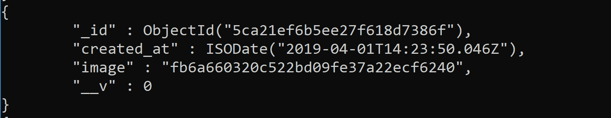
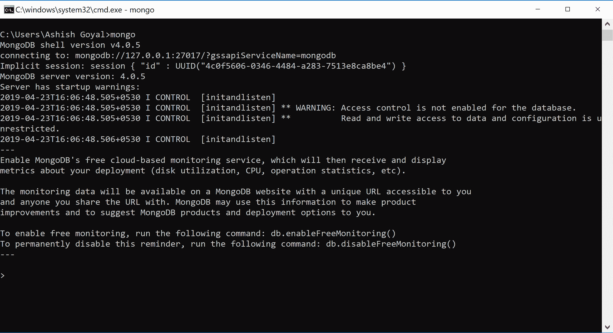
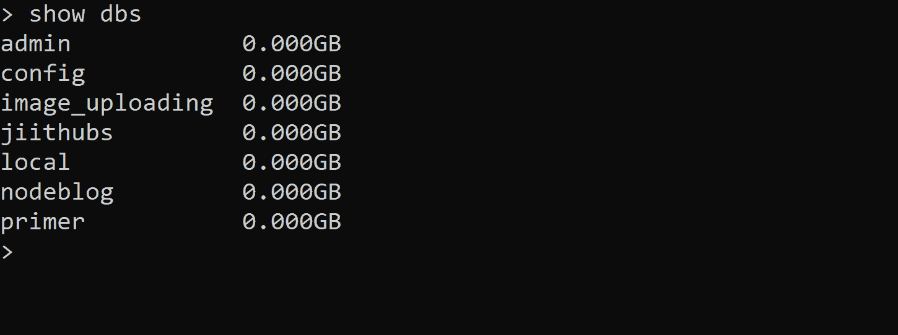
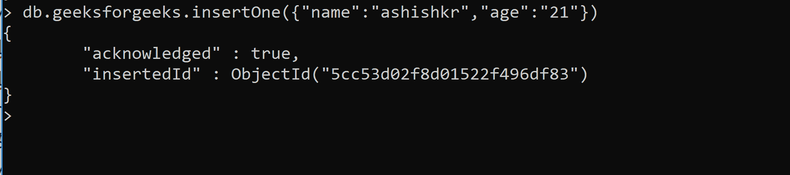
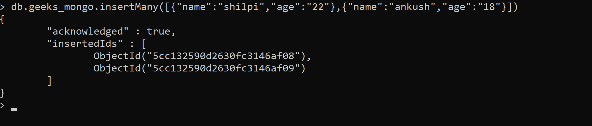
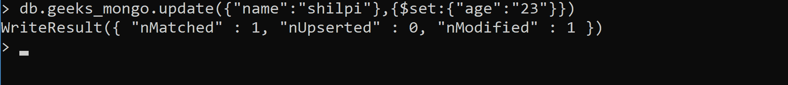
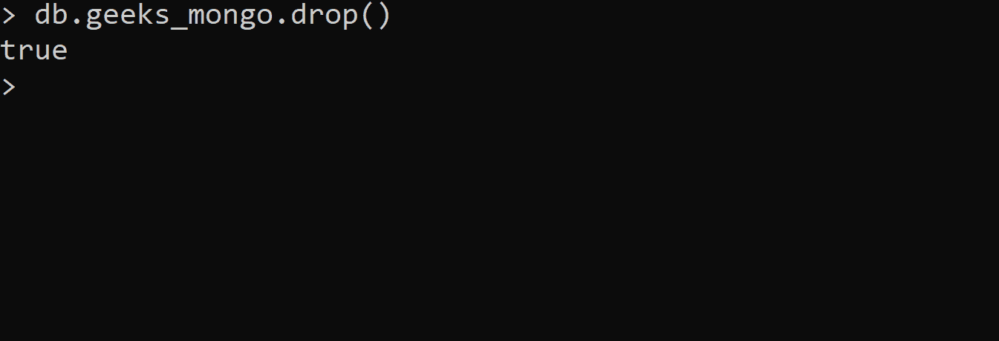

# 定义、创建和删除 MongoDB 集合

> 原文:[https://www . geesforgeks . org/definition-creating-and-drop-a-MongoDB-collection/](https://www.geeksforgeeks.org/defining-creating-and-dropping-a-mongodb-collection/)

MongoDB 是一个开源的、跨平台的基于文档的数据库。

**Document:** 是 MongoDB 的基本单位，集合内的单个记录称为文档。
它是一个 JSON 对象，具有键值对形式的数据。



**集合:**是单据的分组。集合属于 MongoDB 中的单个数据库。
集合包含文档形式的数据，就像关系数据库管理系统的表包含行和列形式的数据一样。

**Creating a mongodb collection:**

*   **STEP 1: First run the following command into your mongo shell or command prompt**

    ```
    mongo
    ```

    

    *   **STEP 2: Check all the existing databases by using the following command:**

    ```
    show dbs
    ```

    

    *   **STEP 3: Creating a database**
    Here we are creating a database named as- geeksforgeeks

    ```
    use geeksforgeeks
    ```

    如果数据库 geeksforgeeks 存在，它将切换到它，否则它将创建一个新的数据库名 geeksforgeeks，然后切换到它，如下所示。

    

    **Inserting documents in the collection***   **Inserting only one document at a time**

    ```
    db.collection.insertOne(document)
    ```

    

    *   **Inserting more than one document at a time**

    ```
    db.collection.insertMany([
    document_1, document_2.....
    ])
    ```

    

    **编辑收藏:**

    ```
    db.collection.update(query, update)
    query: An object for finding the document
    Example: {"name":"shilpi"}
    update: An object for updating the document with set command
    Example: {$set:{"age":"23"}}

    ```

    *   要编辑 mongodb 集合，请使用更新功能
    *   应用查询来查找要更新的文档。
        在我们的集合中，我们想要更新名称为 shilpi 的集合，因此查询是:

        ```
        {"name":"shilpi"}
        ```

    *   使用 set 命令修改字段名
    *   选择要修改的字段名，然后相应地在查询中输入新值。
        在我们的集合中，我们希望将 shilpi 名称的年龄值编辑为 23:

        ```
        {$set:{"age":"23"}}
        ```

    

    **删除收藏:**

    ```
    db.collection.drop()
    ```

    如果集合被成功删除，它将返回 true。
    