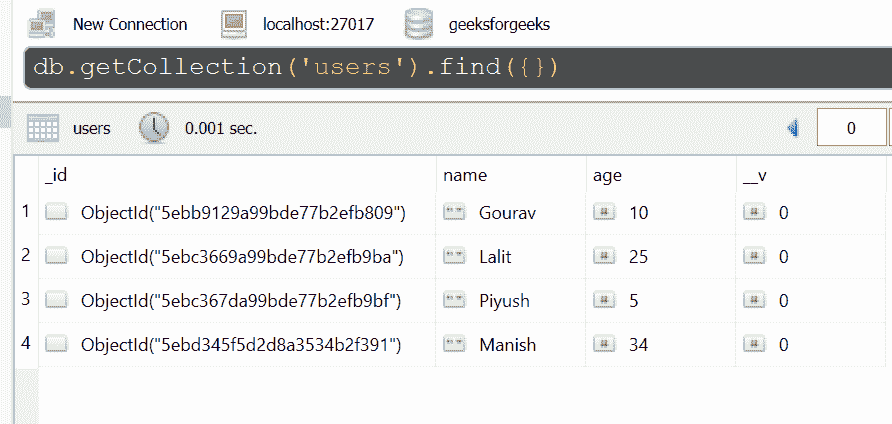

# query . prototype . geometry()在 Mongoose 中是如何工作的？

> 原文:[https://www . geesforgeks . org/how-do-query-prototype-geometry-works-in-mongose/](https://www.geeksforgeeks.org/how-does-query-prototype-geometry-works-in-mongoose/)

**query . prototype . geometry()**函数用于指定$geometry 条件。几何可以在作为参数传递的数组中提供。

**语法:**

```
Query.prototype.geometry()
```

**参数:**该函数有一个对象参数，该参数必须包含字符串类型的类型属性和数组类型的坐标属性。
**返回值:**该函数返回查询对象。
安装獴:

```
npm install mongoose
```

安装猫鼬模块后，可以使用命令在命令提示符下检查您的**猫鼬**版本。

```
npm mongoose --version
```

**数据库:**这里使用的样本数据库如下所示。



之后，您可以创建一个文件夹并添加一个文件，例如 index.js，如下所示。

**项目结构:**项目结构会是这样的。


**例 1:**

## index.js

```
const mongoose = require('mongoose');

// Database connection
mongoose.connect('mongodb://127.0.0.1:27017/geeksforgeeks', {
    useNewUrlParser: true,
    useCreateIndex: true,
    useUnifiedTopology: true
});

// User model
const User = mongoose.model('User', { 
    name: { type: String },
    age: { type: Number }
});

var query = User.find()

var polyA = [[[ 11, 21 ], [ 11, 41 ], [ 31, 41 ], [ 31, 21 ]]]
query.where('loc').within()
            .geometry({ type: 'Polygon', coordinates: polyA })

console.log(query._conditions.loc)
```

使用以下命令运行 **index.js** 文件:

```
node index.js
```

**输出:**

```
{
  '$geoWithin': { '$geometry': { 
    type: 'Polygon', coordinates: [Array] } }
}
```

**例 2:**

## index.js

```
const express = require('express');
const mongoose = require('mongoose');
const app = express()

// Database connection
mongoose.connect('mongodb://127.0.0.1:27017/geeksforgeeks', {
    useNewUrlParser: true,
    useCreateIndex: true,
    useUnifiedTopology: true
});

// User model
const User = mongoose.model('User', { 
    name: { type: String },
    age: { type: Number }
});

var query = User.find()

var polyA = [[[ 15, 25 ], [ 15, 45 ], [ 35, 45 ], [ 35, 25 ]]]
query.where('loc').within()
            .geometry({ type: 'Polygon', coordinates: polyA })

console.log(query._conditions.loc)

app.listen(3000, function(error ) {
    if(error) console.log(error)
    console.log("Server listening on PORT 3000")
});
```

使用以下命令运行 **index.js** 文件:

```
node index.js
```

**输出:**

```
Server listening on PORT 3000
{
  '$geoWithin': { '$geometry': { 
     type: 'Polygon', coordinates: [Array] } }
}
```

**参考:**
[https://mongoosejs . com/docs/API/Query . html # Query _ Query-geometry](https://mongoosejs.com/docs/api/query.html#query_Query-geometry)