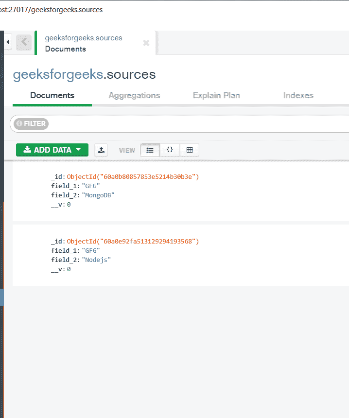
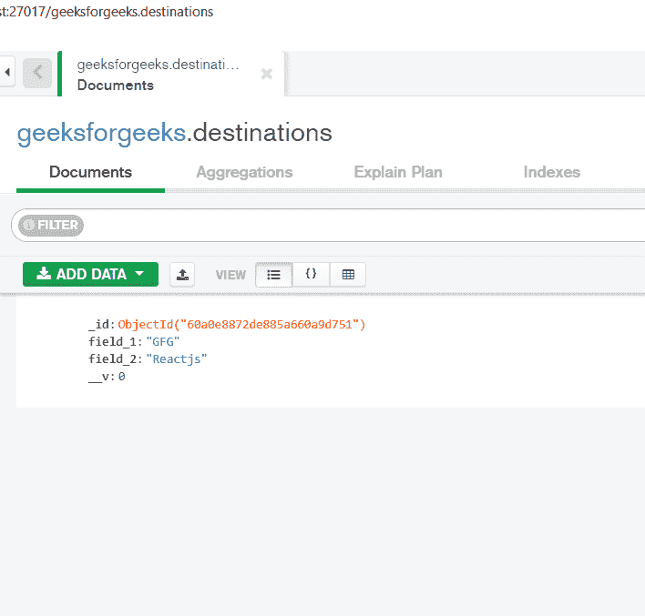
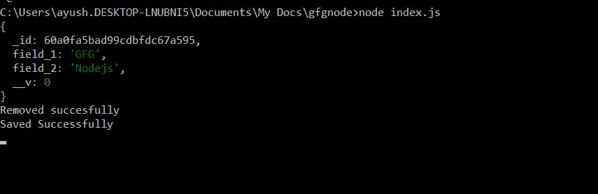
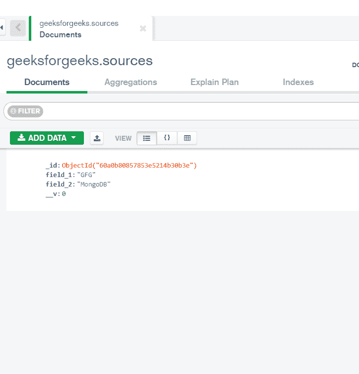
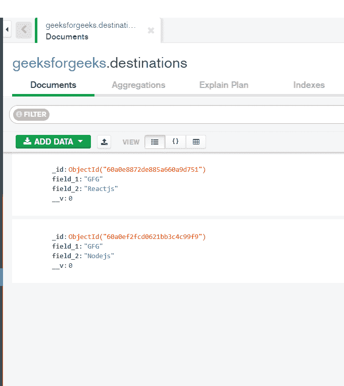

# 如何将 MongoDB 文档从一个集合移动到另一个集合？

> 原文:[https://www . geesforgeks . org/how-to-MongoDB-document-从一个集合到另一个集合/](https://www.geeksforgeeks.org/how-to-move-mongodb-document-from-one-collections-to-another/)

以下方法涵盖了将 MongoDB 文档从一个集合移动到另一个集合。在 mongoose 的帮助下，我们将把 MongoDB 文档从一个集合移动到另一个集合。确保在两个集合的模式中，所有字段都是相同的。

**安装猫鼬:**

**第一步:**可以访问[安装獴](https://www.npmjs.com/package/mongoose)链接安装*獴*模块。您可以使用此命令安装此软件包。

```
npm install mongoose
```

**步骤 2:** 现在，您可以使用以下命令导入文件中的猫鼬模块:

```
const mongoose = require('mongoose');
```

**数据库:**在移动之前，我们的源和目标集合中已经有文档，如下所示:

**移动前的源集:**我们移动前的源集会是这样的。



移动前的源集合

**移动前目的地集合:**我们移动前的目的地集合会是这样的。



移动前的目标集合

**实施:**

创建一个文件夹，可以在其中添加两个文件 **model.js** 和 **index.js** ，如下图:

*   **model.js:** 它包含源集合和目标集合的模式，并导出这两个模式的模型。
*   **index.js:** 它包含将文档从源模式移动到目标模式的代码。

## index.js

```
// Requiring module
const mongoose = require('mongoose');

// Importing models from model.js
const { Source, Destination } = require('./model');

// Connecting to database
mongoose.connect('mongodb://localhost:27017/geeksforgeeks',
    {
        useNewUrlParser: true,
        useUnifiedTopology: true,
        useFindAndModify: false,
        useCreateIndex: true
    });

// Finding a doc in the source collection by any 
// field and moving it to the destination collection
Source.findOne({ field_2: "Nodejs" })
    .then(doc => {
        console.log(doc);

        // Inserting the doc in destination collection
        Destination.insertMany([doc])
            .then(d => {
                console.log("Saved Successfully");
            })
            .catch(error => {
                console.log(error);
            })

        // Removing doc from the source collection
        Source.deleteOne({ field_2: doc.field_2 })
            .then(d => {
                console.log("Removed succesfully")
            })
            .catch(error => {
                console.log(error);
            });
    })
    .catch(error => {
        console.log(error);
})
```

## model.js

```
// Requiring module
const mongoose = require('mongoose');

// Defining source schema
const sourceSchema = new mongoose.Schema({
    field_1: String,
    field_2: String
});

// Defining destination schema
const destinationSchema = new mongoose.Schema({
    field_1: String,
    field_2: String
});

// Creating model for both schemas
const Source = mongoose.model('source', sourceSchema);
const Destination = mongoose.model(
    'destination', destinationSchema);

// Exporting our modals
module.exports = {
    Source, Destination
}
```

使用以下命令运行 **index.js** :

```
node index.js
```

**输出:**



执行 index.js 后控制台中的输出

**移动后的源集:**我们移动后的源集会是这样的。



移动后的源集合

**移动后的目的地集合:**我们移动后的目的地集合会是这样的。



移动后的目标集合