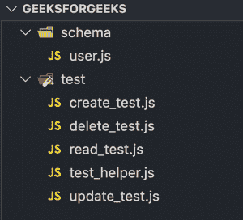

# 摩卡和猫鼬怎么用？

> 原文:[https://www . geesforgeks . org/如何使用猫鼬摩卡/](https://www.geeksforgeeks.org/how-to-use-mocha-with-mongoose/)

**摩卡:**摩卡是一个测试框架，用于在我们的应用程序中执行测试。它确保一切正常。

“Node.js 中的 Mocha”是指在 Node.js 运行时环境中使用 mocha 单元测试框架。摩卡有很多很棒的特色。

**主要特征:**

*   简单异步支持。
*   异步测试超时支持。
*   使用您想要的任何断言库
*   每次测试前、后、前、后挂钩对清洁环境非常有用。

如果你不熟悉**猫鼬**、[点击这里](https://www.geeksforgeeks.org/mongoose-module-introduction/)。

在一段时间内，我们的应用程序将有更多的代码行用于测试，而不是真正的应用程序基本原理。因此，编写测试并遵循测试驱动开发或 TDD 方法始终是值得感谢的事情。

在这篇文章中，我们将建立一个基本的测试套件，利用最著名的摩卡测试结构，在 MongoDB 数据集上使用 mongos 库进行我们的创建、读取、更新和删除(CRUD)过程。

**安装模块:**

```
npm i mocha mongoose
```

**文件夹结构:**我们将在测试目录中创建所有的测试文件。



在我们的 Node.js-MongoDB 项目中，我们将使用这个帮助文件来创建连接。如果你是 MongoDB [的新手，可以查看这个帖子](https://www.geeksforgeeks.org/how-to-create-database-collection-in-mongodb/)。

## 测试助手. js

```
// test/test_helper.js

const mongoose = require('mongoose');

// tells mongoose to use ES6 implementation of promises
mongoose.Promise = global.Promise;
const MONGODB_URI = 'mongodb://mongodb0.example.com:27017';
mongoose.connect(MONGODB_URI);

mongoose.connection
    .once('open', () => console.log('Connected!'))
    .on('error', (error) => {
        console.warn('Error : ', error);
    });

    // runs before each test
    beforeEach((done) => {
        mongoose.connection.collections.users.drop(() => {
        done();
       });
});
```

在测试运行之前，我们将使用 beforeEach()钩子清空数据库。删除需要时间，所以我们需要在手术结束前拿着摩卡。调用 done()函数表明操作现在已经完成，我们可以继续执行。

那个。on()和。once()是事件处理程序。它们将事件作为第一个参数，将函数作为第二个参数，一旦事件发生，函数就会执行。


**我们的 MongoDB 模式:**

## user.js

```
// Inside schema/user.js

const mongoose = require('mongoose');
const Schema = mongoose.Schema;

const UserSchema = new Schema({
    name: {
        type: String,
        required: [true, 'Name is required.']
      },
    age: Integer
 })

// it represents the entire collection of User data
const User = mongoose.model('User', UserSchema);
module.exports = User;
```

现在，我们需要 package.json 文件中的一个脚本来开始测试。

```
"scripts": { 
  "test" : "mocha --recursive --exit"
 }
```

in–recursive 表示它将在测试目录中递归测试，并且–exit 表示在所有测试执行完毕后退出。使用以下命令使用 Mocha 运行测试。

```
npm run test
```

Mocha 为我们提供了一个 description()函数，该函数以一个字符串作为第一个参数，用于标识通过或失败的测试组，测试逻辑作为 description()的第二个参数中的函数来实现。

description()可能在 it()方法或嵌套 description()函数中包含多个测试。在我们的例子中，我们将为 MongoDB 中的每个 CRUD 操作制作不同的文件。或者，我们可以使用具有不同描述块的单个文件。

由于每个测试都需要我们断言一些东西，摩卡允许我们使用许多断言库。这里我们将使用 Node.js 的内置断言模块。

通过在测试回调中向它()添加 done()，摩卡将知道这个测试已经完成。

## create_test.js

```
//import the User model
const User = require('../schema/user');
const assert = require('assert');

describe('Creating documents in MongoDB', () => {
    it('Creates a New User', (done) => {
        const newUser = new User({ name: 'Shriyam' });
        newUser.save() // returns a promise after some time
            .then(() => {
                //if the newUser is saved in db and it is not new
                assert(!newUser.isNew);
                done();
            });
    });
});
```

## 读取 _test.js

```
const User = require('../schema/user');
const assert = require('assert');

let user;
// this will run before running every test
beforeEach(() => {
    // Creating a new Instance of User Model
    user = new User({  name: 'Shriyam' });
    user.save()
        .then(() => done());
});

describe('Reading Details of User', () => {
    it('Finds user with the name', (done) => {
        User.findOne({ name: 'Shriyam' })
            .then((user) => {
                assert(user.name === 'Shriyam');
                done();
            });
    })
})
```

## 删除 _test.js

```
const User = require('../schema/user');
const assert = require('assert');

describe('Deleting a User', () => {

    let user;
    beforeEach((done), () => {
        // user is an instance of User Model
        user = new User({ name: 'Shriyam' });
        user.save()
            .then(() => done());
    });

    it('Removes a User using its instance', (done) => {
    User.remove()
        // Checking if the user was deleted from DB or not
        .then(() => User.findOne({ name: 'Shriyam' }))
        .then((user) => {
            assert(user === null);
            done();
        });
    });

    it('Removes a user', (done) => {
    User.findOneAndRemove({ name: 'Shriyam' })
        .then(() => User.findOne({ name: 'Shriyam' }))
        .then((user) => {
            assert(user === null);
            done();
        });
    });

    it('Removes a user using its id', (done) => {
    User.findIdAndRemove(user._id)
        .then(() => User.findOne({ name: 'Shriyam' }))
        .then((user) => {
            assert(user === null);
            done();
        });
    })
})
```

## 更新 _test.js

```
const Username = require('../schema/user');
const assert = require('assert');

describe('Deleting a user', () => {

    let user;
    beforeEach((done) => {
        user = new User({ name: 'Shriyam' });
        user.save()
            .then(() => done());
    });

    // Handling Redundant Code
    function helperFunc(assertion, done) {
    assertion
        .then(() => User.find({}))
        .then((users) => {
            assert(users.length === 1);
            assert(users[0].name === 'Updated Shriyam');
            done();
        });
    }

    it('Sets and saves a user using an instance', (done) => {
        // Not yet updated in MongoDb
        user.set('name', 'Updated Shriyam');
        helperFunc(user.save(), done);
    });

    it('Update a user using instance', (done) => {
        helperFunc(user.update({ name: 'Updated Shriyam' }), done);
    });
});
```

因此，我们现在已经学习了如何使用摩卡和猫鼬创建单元测试。
**提示:**使用 *mockgoose* 库来使用一个虚拟蒙古数据库，这样你的原始数据库就保持干净了。