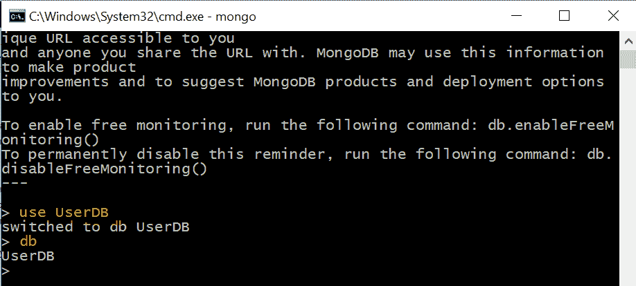
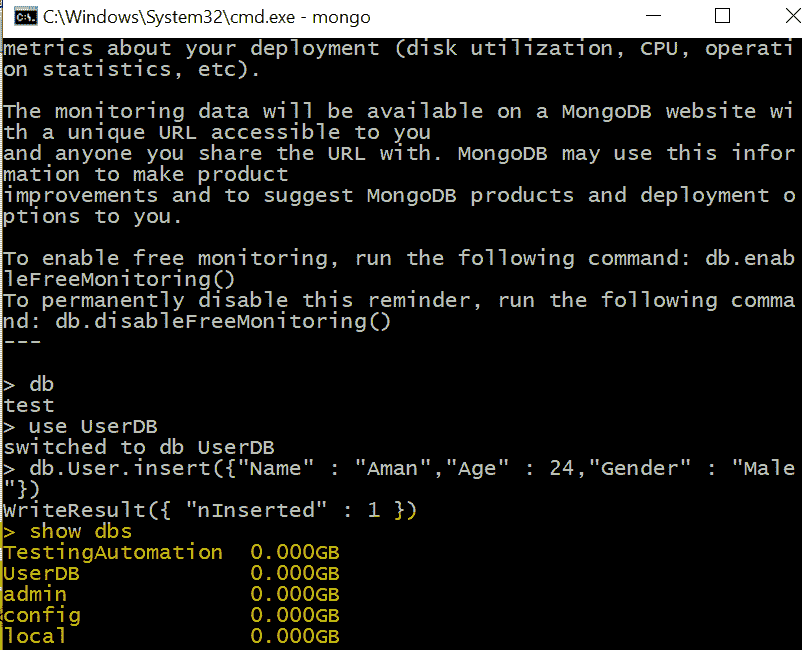
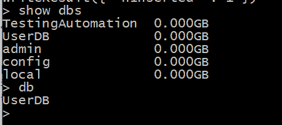
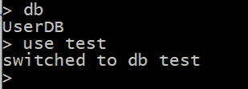

# MongoDB |使用 MongoShell 创建数据库

> 原文:[https://www . geesforgeks . org/MongoDB-create-database-using-mongoshell/](https://www.geeksforgeeks.org/mongodb-create-database-using-mongoshell/)

蒙古数据库是所有集合的容器，其中集合是一堆类似于关系数据库管理系统中的表的蒙古数据库文档，文档由类似于关系数据库管理系统中的元组的字段组成，但是它在这里有一个动态模式。

**文档示例**:

```
{
        "Name" : "Aman",
        Age : 24,
        Gender : "Male"    
}

```

*以上文档包含 JSON 格式的个人信息。*
如果我们有一堆文档，那么它会创建一个集合。因此，我们可以说用户集合包含包含用户信息的文档。

**集合示例**:

```
[    
    {
        "Name" : "Aman",
        Age : 24,
        Gender : "Male"    
    },
    {
        "Name" : "Suraj",
        Age : 32,
        Gender : "Male"    
    },
    {
        "Name" : "Joyita",
        "Age" : 21,
        "Gender" : "Female"
    },
    {
        "Name" : "Mahfuj",
        "Age" : 24,
        "Gender" : "Male"
    },
]

```

**MongoShell**:
MongoShell 是一个交互式的 JavaScript 接口，用于在 MongoDB 中查询和更新数据以及执行管理操作。

**数据库:**在 MongoDB 中，数据库基本上保存着文档的集合。数据库包含包含文档的集合。在单个 MongoDB 服务器上，我们可以运行多个数据库。MongoDB 的默认创建数据库是数据文件夹中的“数据库”。当您安装 MongoDB 时，会自动生成一些数据库来使用。因此，我们可以说，在开始使用数据库之前，不需要创建数据库。

**新建数据库:**可以使用“使用 Database_Name”命令在 MongoDB 中创建新数据库。如果不存在，该命令将创建一个新的数据库，否则，它将返回现有的数据库，您可以在 mongo shell 中运行该命令来创建一个新的数据库。您新创建的数据库不在数据库列表中。要显示数据库，您需要在其中插入至少一个文档。

**语法:**

```
 use Database_Name
```

**示例:创建新数据库**


在 MongoDB 中，默认数据库是 test。如果没有创建任何数据库并开始插入集合，则所有集合都存储在默认数据库中。

**显示数据库列表:**您可以使用命令“**显示数据库**来检查当前选择的数据库。您新创建的数据库不在数据库列表中。要显示任何数据库，您需要在其中插入至少一个或多个文档。

**示例:数据库列表**


**检查当前数据库:**您可以使用命令“**数据库**”检查数据库列表

**示例:检查当前选定的数据库**


**切换到其他数据库:**可以使用命令“**使用 Database_Name** 切换到其他数据库。如果数据库不存在，它将创建一个新的数据库。

**示例:切换到另一个数据库**

*在上面的示例中，首先我们使用 db 命令检查当前数据库名称，该命令是 UserDB，然后我们使用“使用测试”命令切换到数据库测试。*

**参考文献:**
[https://docs . MongoDB . com/manual/core/databases-and-collections/# databases](https://docs.mongodb.com/manual/core/databases-and-collections/#databases)