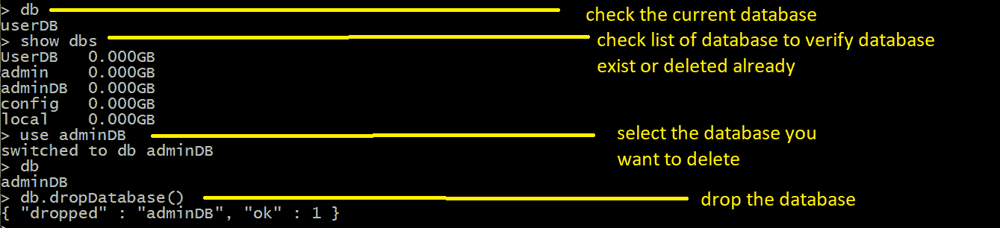

# MongoDB |使用 MongoShell 删除数据库

> 原文:[https://www . geesforgeks . org/MongoDB-delete-database-using-mongoshell/](https://www.geeksforgeeks.org/mongodb-delete-database-using-mongoshell/)

**先决条件:** [MongoDB 简介](https://www.geeksforgeeks.org/mongodb-an-introduction/)

**简短描述:**MongoDB 数据库是所有集合的容器，其中 Collection 是一堆类似于 RDBMS 中的表的 MongoDB 文档，Document 是由类似于 RDBMS 中的元组的字段组成，但这里它有一个动态模式。
**文档示例:**

```
{
        "Name" : "Aman",
        Age : 24,
        Gender : "Male"    
}

```

**集合示例:**

```
[    
    {
        "Name" : "Aman",
        Age : 24,
        Gender : "Male"    
    },
    {
        "Name" : "Suraj",
        Age : 32,
        Gender : "Male"    
    },
    {
        "Name" : "Joyita",
        "Age" : 21,
        "Gender" : "Female"
    }
]

```

**MongoShell:**MongoShell 是一个交互式的 JavaScript 接口，用于在 MongoDB 中查询和更新数据以及执行管理操作。关于蒙古贝壳的详细解释在这个[网站上给出。](https://docs.mongodb.com/manual/mongo/)

**删除数据库:**在 MongoDB 中，数据库保存文档集合。在单个 MongoDB 服务器上，我们可以运行多个数据库。安装 MongoDB 时，会自动生成一些数据库来使用。很多时候，当数据库不再使用时，您需要删除一些数据库。

**db.dropDatabase()** 该命令用于删除现有数据库。此命令将删除当前选定的数据库。如果您没有选择任何数据库，那么它将删除默认的“测试”数据库。

**语法:**

```
 db.dropDatabase()
```

**示例:**下面的截图显示了对新创建的数据库名 userDB 使用“db.dropDatabase()”命令。
T3】

**如何删除当前未使用的数据库:**可以使用命令“ **db** 检查当前选中的数据库。然后您可以使用“**显示数据库**”命令来检查数据库列表。然后使用命令**使用数据库名称**选择要删除的数据库。然后执行 **db.dropDatabase()** 命令删除现有数据库。

**示例:**在下面的示例中，我们使用的是数据库名称 userDB，我们希望删除不同的数据库名称 adminDB。所以首先我们要选择 adminDB 数据库，然后删除这个数据库。



**参考文献:**
[https://docs . MongoDB . com/manual/core/databases-and-collections/# databases](https://docs.mongodb.com/manual/core/databases-and-collections/#databases)