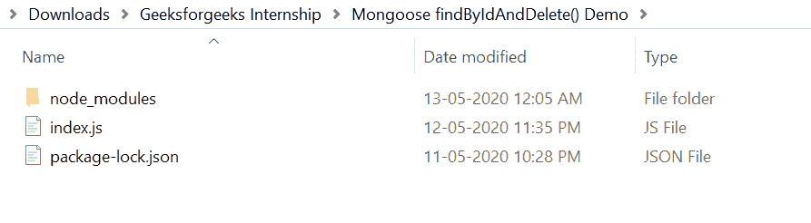

# MongoDB | ObjectID()函数

> 原文:[https://www.geeksforgeeks.org/mongodb-objectid-function/](https://www.geeksforgeeks.org/mongodb-objectid-function/)

**ObjectID()函数:** MongoDB 使用 ObjectID 为数据库中的所有文档创建唯一的标识符。它不同于传统的自动递增整数标识，但它有自己的一套优势。

对象标识符是一个 GUID(全球唯一标识符)。GUIDs 通过算法随机生成，以确保唯一性。这些标识可以在服务器上生成，但是如上面的片段所示，它们也可以在客户端上生成。这意味着客户端可以为将要插入数据库的文档生成标识。

**MongoDB 模块安装:**

1.  您可以访问[安装 mongodb 模块](https://www.npmjs.com/package/mongodb)的链接。您可以使用此命令安装此软件包。

    ```
    npm install mongodb
    ```

2.  安装 mongodb 模块后，您可以使用命令在命令提示符下检查您的 mongodb 版本。

    ```
    npm version mongodb
    ```

3.  之后，您可以创建一个文件夹并添加一个文件，例如 index.js。

    ```
    node index.js
    ```

MongoDB 提供了 ObjectID，可以用来生成新的 ObjectID。下面的示例生成一个新的标识，并将其打印到控制台。

**文件名:index.js**

```
const { MongoClient, ObjectID } = require('mongodb');
const id = new ObjectID();

// Print new id to the console
console.log(id); 
```

**运行程序的步骤:**

1.  项目结构会是这样的:
    
2.  确保您已经使用以下命令安装了 mongodb 模块:

    ```
    npm install mongodb
    ```

3.  Run index.js file using below command:

    ```
    node index.js
    ```

    

这就是如何使用 MongoDB ObjectID()函数为数据库中的所有文档创建唯一的标识符。