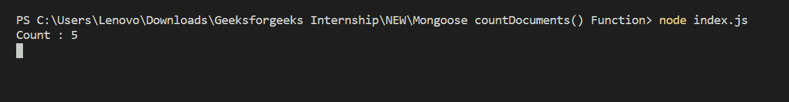

# 猫鼬| countDocuments()功能

> 原文:[https://www . geesforgeks . org/mongose-count documents-function/](https://www.geeksforgeeks.org/mongoose-countdocuments-function/)

**countDocuments()函数**用于统计数据库集合中匹配过滤器的文档数量。

**猫鼬模块安装:**

*   可以访问[安装猫鼬模块](https://www.npmjs.com/package/mongoose)的链接。您可以使用此命令安装此软件包。

```
npm install mongoose

```

*   安装猫鼬模块后，您可以使用命令在命令提示符下检查您的猫鼬版本。

```
npm version mongoose

```

*   之后，您可以创建一个文件夹并添加一个文件，例如 index.js。

```
node index.js

```

**文件名:index.js**

## java 描述语言

```
const mongoose = require('mongoose');

// Database Connection
mongoose.connect('mongodb://127.0.0.1:27017/geeksforgeeks', {
    useNewUrlParser: true,
    useCreateIndex: true,
    useUnifiedTopology: true
});

// User model
const User = mongoose.model('User', {
    name: { type: String },
    age: { type: Number }
});

User.countDocuments({age:{$gte:5}}, function (err, count) {
    if (err){
        console.log(err)
    }else{
        console.log("Count :", count)
    }
});
```

**运行程序的步骤:**

*   项目结构如下所示:


*   确保您已经使用以下命令安装了猫鼬模块:

```
npm install mongoose

```

*   下面是执行函数之前数据库中的示例数据。您可以使用任何图形用户界面工具或终端来查看数据库，就像我们使用 Robo3T 图形用户界面工具一样，如下所示:


*   使用以下命令运行 index.js 文件:

```
node index.js

```



这就是如何使用 mongoose countDocuments()函数，该函数计算数据库集合中匹配过滤器的文档数量。