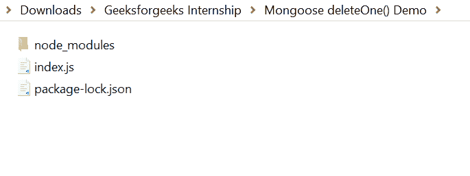
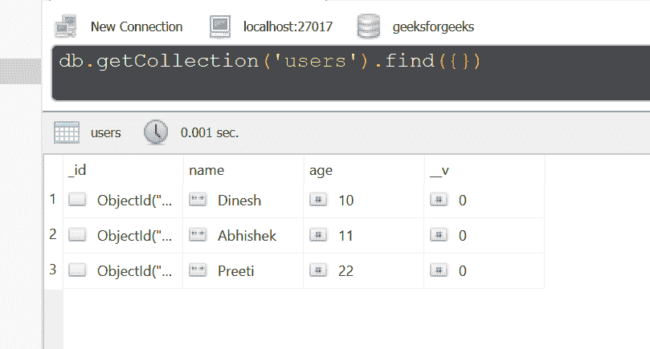
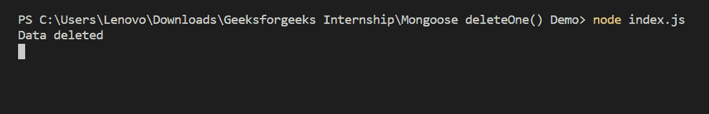
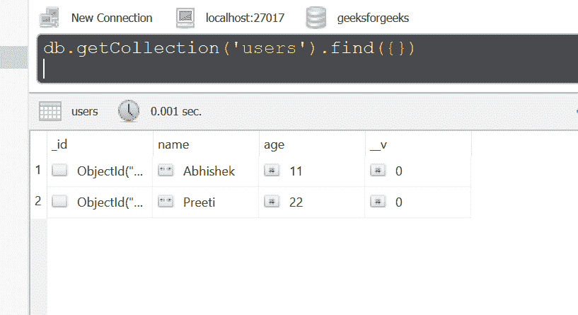

# 猫鼬|删除 One()功能

> 原文:[https://www.geeksforgeeks.org/mongoose-deleteone-function/](https://www.geeksforgeeks.org/mongoose-deleteone-function/)

**deleteOne()函数**用于从集合中删除第一个符合条件的文档。它的行为类似于 remove()函数，但不管单一选项如何，最多删除一个文档。

**猫鼬模块安装:**

1.  您可以访问[安装猫鼬模块](https://www.npmjs.com/package/mongoose)的链接。您可以使用此命令安装此软件包。

    ```
    npm install mongoose
    ```

2.  安装猫鼬模块后，您可以使用命令在命令提示符下检查您的猫鼬版本。

    ```
    npm version mongoose
    ```

3.  之后，您可以创建一个文件夹并添加一个文件，例如 index.js。

    ```
    node index.js
    ```

**文件名:index.js**

```
const mongoose = require('mongoose');

// Database connection
mongoose.connect('mongodb://127.0.0.1:27017/geeksforgeeks', {
    useNewUrlParser: true,
    useCreateIndex: true,
    useUnifiedTopology: true
});

// User model
const User = mongoose.model('User', {
    name: { type: String },
    age: { type: Number }
});

// Function call
// Delete first document that matches
// the condition i.e age >= 10
User.deleteOne({ age: { $gte: 10 } }).then(function(){
    console.log("Data deleted"); // Success
}).catch(function(error){
    console.log(error); // Failure
});
```

**运行程序的步骤:**

1.  项目结构会是这样的:
    
2.  确保您已经使用以下命令安装了猫鼬模块:

    ```
    npm install mongoose
    ```

3.  下面是 deleteOne()函数执行前数据库中的样本数据，可以使用任何 GUI 工具或终端查看数据库，就像我们已经使用的 Robo3T GUI 工具如下所示:
    
4.  Run index.js file using below command:

    ```
    node index.js
    ```

    

5.  运行上述命令后，您可以看到数据已从数据库中删除。
    

这就是如何使用 mongoose deleteOne()函数从 MongoDB 和 Node.js 的集合中删除第一个符合条件的文档