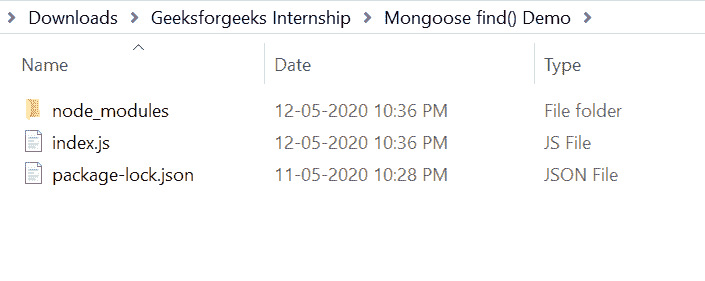
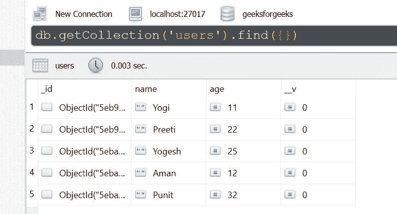
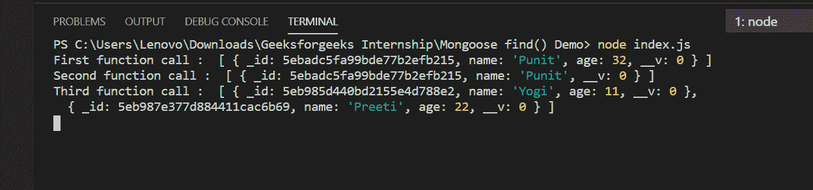

# 猫鼬寻找()功能

> 原文:[https://www.geeksforgeeks.org/mongoose-find-function/](https://www.geeksforgeeks.org/mongoose-find-function/)

**find()函数**用于从 MongoDB 数据库中查找特定数据。它需要 3 个参数，它们是 query(也称为条件)、query projection(用于提及要在查询中包括或排除哪些字段)，最后一个参数是常规查询选项(如 limit、skip 等)。

**猫鼬模块安装:**

1.  你可以访问安装猫鼬模块 https://www.npmjs.com/package/mongoose.的链接。你可以使用这个命令安装这个包。

    ```
    npm install mongoose
    ```

2.  安装猫鼬模块后，您可以使用命令在命令提示符下检查您的猫鼬版本。

    ```
    npm version mongoose
    ```

3.  之后，您可以创建一个文件夹并添加一个文件，例如 index.js。

    ```
    node index.js
    ```

**文件名:index.js**

```
const mongoose = require('mongoose');

// Database connection
mongoose.connect('mongodb://127.0.0.1:27017/geeksforgeeks', {
    useNewUrlParser: true,
    useCreateIndex: true,
    useUnifiedTopology: true
});

// User model
const User = mongoose.model('User', {
    name: { type: String },
    age: { type: Number }
});

// Only one parameter [query/condition]
// Find all documents that matches the
// condition name='Punit'
User.find({ name: 'Punit'}, function (err, docs) {
    if (err){
        console.log(err);
    }
    else{
        console.log("First function call : ", docs);
    }
});

// Only Two parameters [condition, query projection]
// Here age:0 means don't include age field in result 
User.find({ name: 'Punit'}, {age:0}, function (err, docs) {
    if (err){
        console.log(err);
    }
    else{
        console.log("Second function call : ", docs);
    }
});

// All three parameter [condition, query projection,
// general query options]
// Fetch first two records whose age >= 10 
// Second parameter is null i.e. no projections
// Third parameter is limit:2 i.e. fetch
// only first 2 records
User.find({ age: {$gte:10}}, null, {limit:2}, function (err, docs) {
    if (err){
        console.log(err);
    }
    else{
        console.log("Third function call : ", docs);
    }
});
```

**运行程序的步骤:**

1.  项目结构会是这样的:
    
2.  确保您已经使用以下命令安装了猫鼬模块:

    ```
    npm install mongoose
    ```

3.  下面是 find()函数执行前数据库中的样本数据，可以使用任何 GUI 工具或终端查看数据库，就像我们已经使用的 Robo3T GUI 工具如下所示:
    
4.  Run index.js file using below command:

    ```
    node index.js
    ```

    

这就是如何在 Node.js 和 MongoDB 中使用 mongoose find()函数。