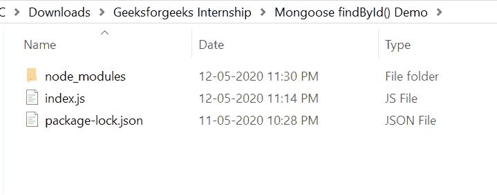
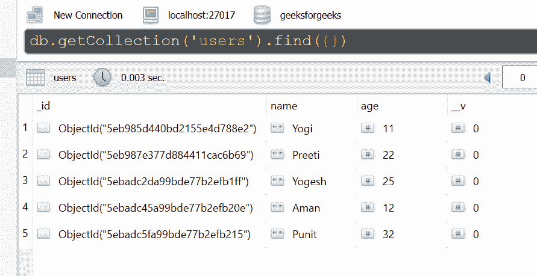

# 猫鼬| findById()功能

> 原文:[https://www.geeksforgeeks.org/mongoose-findbyid-function/](https://www.geeksforgeeks.org/mongoose-findbyid-function/)

函数的作用是:通过文档的 _id 字段来查找单个文档。在发送命令之前，基于模式对 _id 字段进行强制转换。

**猫鼬模块安装:**

1.  您可以访问链接[安装猫鼬模块](https://www.npmjs.com/package/mongoose)。您可以使用此命令安装此软件包。

    ```
    npm install mongoose
    ```

2.  安装猫鼬模块后，您可以使用命令在命令提示符下检查您的猫鼬版本。

    ```
    npm version mongoose
    ```

3.  之后，您可以创建一个文件夹并添加一个文件，例如 index.js。

    ```
    node index.js
    ```

**文件名:index.js**

```
const mongoose = require('mongoose');

// Database connection
mongoose.connect('mongodb://127.0.0.1:27017/geeksforgeeks', {
    useNewUrlParser: true,
    useCreateIndex: true,
    useUnifiedTopology: true
});

// User model
const User = mongoose.model('User', {
    name: { type: String },
    age: { type: Number }
});

// Finding a document whose id=5ebadc45a99bde77b2efb20e
var id = '5ebadc45a99bde77b2efb20e';
User.findById(id, function (err, docs) {
    if (err){
        console.log(err);
    }
    else{
        console.log("Result : ", docs);
    }
});
```

**运行程序的步骤:**

1.  项目结构会是这样的:
    
2.  确保您已经使用以下命令安装了猫鼬模块:

    ```
    npm install mongoose
    ```

3.  下面是函数执行前数据库中的样本数据，你可以使用任何 GUI 工具或终端查看数据库，就像我们已经使用的 Robo3T GUI 工具如下所示:
    
4.  Run index.js file using below command:

    ```
    node index.js
    ```

    

这就是如何使用 mongoose findById()函数通过其 _id 字段查找单个文档。