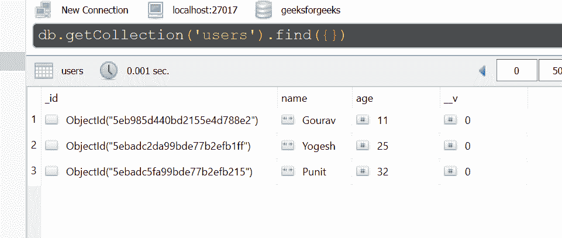
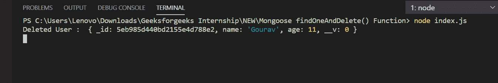
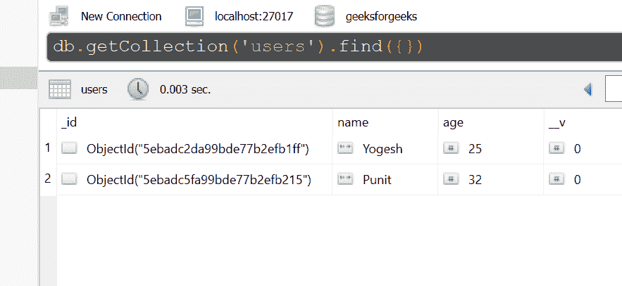

# 猫鼬| findOneAndDelete()功能

> 原文:[https://www . geesforgeks . org/mongose-findone and delete-function/](https://www.geeksforgeeks.org/mongoose-findoneanddelete-function/)

**findonanddelete()函数**用于查找匹配的文档，将其移除，并将找到的文档(如果有)传递给回调。

**猫鼬模块安装:**

1.  您可以访问[安装猫鼬模块](https://www.npmjs.com/package/mongoose)的链接。您可以使用此命令安装此软件包。

    ```
    npm install mongoose
    ```

2.  安装猫鼬模块后，您可以使用命令在命令提示符下检查您的猫鼬版本。

    ```
    npm version mongoose
    ```

3.  之后，您可以创建一个文件夹并添加一个文件，例如 index.js。

    ```
    node index.js
    ```

**文件名:index.js**

```
const mongoose = require('mongoose');

// Database connection
mongoose.connect('mongodb://127.0.0.1:27017/geeksforgeeks', {
    useNewUrlParser: true,
    useCreateIndex: true,
    useUnifiedTopology: true
});

// User model
const User = mongoose.model('User', {
    name: { type: String },
    age: { type: Number }
});

// Find only one document matching the
// condition(age >= 5) and delete it
User.findOneAndDelete({age: {$gte:5} }, function (err, docs) {
    if (err){
        console.log(err)
    }
    else{
        console.log("Deleted User : ", docs);
    }
});
```

**运行程序的步骤:**

1.  项目结构会是这样的:
    
2.  确保您已经使用以下命令安装了猫鼬模块:

    ```
    npm install mongoose
    ```

3.  下面是函数执行前数据库中的样本数据，你可以使用任何 GUI 工具或终端查看数据库，就像我们已经使用的 Robo3T GUI 工具如下所示:
    
4.  Run index.js file using below command:

    ```
    node index.js
    ```

    

5.  执行该功能后，可以在数据库中看到该特定用户被删除，如下所示:
    

这就是如何使用 mongoose findOneAndDelete()函数，该函数查找匹配的文档，删除它，并将找到的文档(如果有)传递给回调。