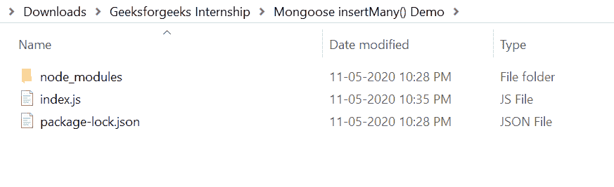
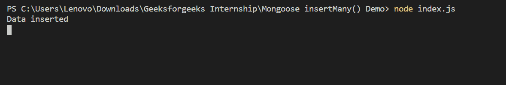
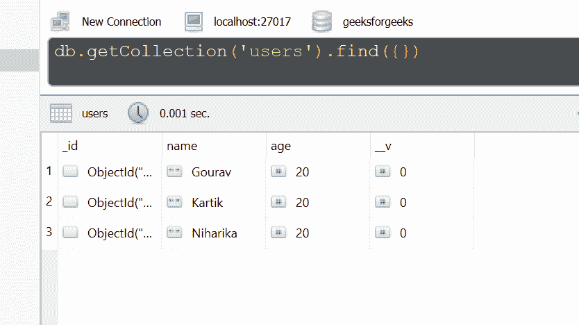

# 猫鼬|插入许多()功能

> 原文:[https://www.geeksforgeeks.org/mongoose-insertmany-function/](https://www.geeksforgeeks.org/mongoose-insertmany-function/)

**insert multi()功能**用于将多个文档插入一个集合中。它接受要插入集合的文档数组。

**猫鼬模块安装:**

1.  您可以访问链接[安装猫鼬模块](https://www.npmjs.com/package/mongoose)。您可以使用此命令安装此软件包。

    ```
    npm install mongoose
    ```

2.  安装猫鼬模块后，您可以使用命令在命令提示符下检查您的猫鼬版本。

    ```
    npm version mongoose
    ```

3.  之后，您可以创建一个文件夹并添加一个文件，例如 index.js。

    ```
    node index.js
    ```

**文件名:index.js**

```
const mongoose = require('mongoose');

// Database connection
mongoose.connect('mongodb://127.0.0.1:27017/geeksforgeeks', {
    useNewUrlParser: true,
    useCreateIndex: true,
    useUnifiedTopology: true
});

// User model
const User = mongoose.model('User', {
    name: { type: String },
    age: { type: Number }
});

// Function call
User.insertMany([
    { name: 'Gourav', age: 20},
    { name: 'Kartik', age: 20},
    { name: 'Niharika', age: 20}
]).then(function(){
    console.log("Data inserted")  // Success
}).catch(function(error){
    console.log(error)      // Failure
});
```

**运行程序的步骤:**

1.  项目结构会是这样的:
    
2.  确保您已经使用以下命令安装了猫鼬模块:

    ```
    npm install mongoose
    ```

3.  Run index.js file using below command:

    ```
    node index.js
    ```

    

4.  运行以上命令后，您可以看到数据被插入到数据库中。你可以使用任何 GUI 工具或终端查看数据库，就像我曾经使用过的 Robo3T GUI 工具如下所示:
    

这就是如何使用 mongoose insertMany()函数将多个文档插入 MongoDB 和 Node.js 中的集合