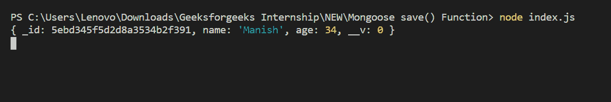
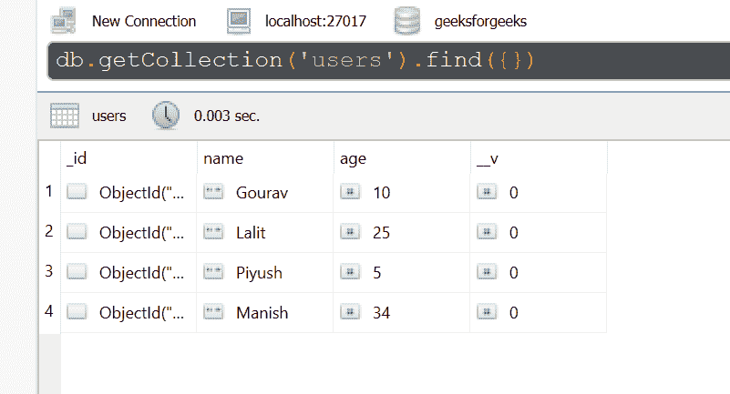

# 猫鼬|保存()功能

> 原文:[https://www.geeksforgeeks.org/mongoose-save-function/](https://www.geeksforgeeks.org/mongoose-save-function/)

**保存()功能**用于将文档保存到数据库中。使用此功能，可以将新文档添加到数据库中。

**猫鼬模块安装:**

1.  您可以访问[安装猫鼬模块](https://www.npmjs.com/package/mongoose)的链接。您可以使用此命令安装此软件包。

    ```
    npm install mongoose
    ```

2.  安装猫鼬模块后，您可以使用命令在命令提示符下检查您的猫鼬版本。

    ```
    npm version mongoose
    ```

3.  之后，您可以创建一个文件夹并添加一个文件，例如 index.js。

    ```
    node index.js
    ```

**文件名:index.js**

```
const mongoose = require('mongoose');

// Database Connection
mongoose.connect('mongodb://127.0.0.1:27017/geeksforgeeks',{
    useNewUrlParser: true,
    useCreateIndex: true,
    useUnifiedTopology: true
});

// User model
const User = mongoose.model('User',{
    name: { type: String },
    age: { type: Number }
});

var new_user = new User({
    name: 'Manish',
    age:34
})

new_user.save(function(err,result){
    if (err){
        console.log(err);
    }
    else{
        console.log(result)
    }
})
```

**运行程序的步骤:**

1.  项目结构会是这样的:
    
2.  确保您已经使用以下命令安装了猫鼬模块:

    ```
    npm install mongoose
    ```

3.  下面是函数执行前数据库中的样本数据，你可以使用任何 GUI 工具或终端查看数据库，就像我们已经使用的 Robo3T GUI 工具如下所示:
    
4.  Run index.js file using below command:

    ```
    node index.js
    ```

    

5.  功能执行后，可以在数据库中看到 new_user 保存如下:
    

这就是如何使用 mongoose save()函数将文档保存到数据库中。使用此功能，可以将新文档添加到数据库中。