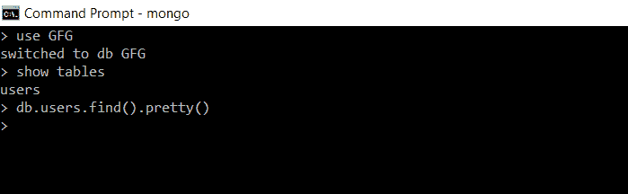
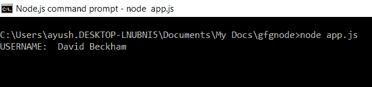
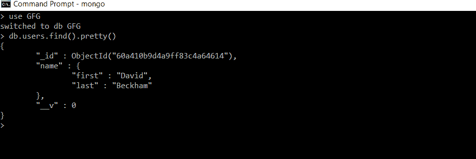
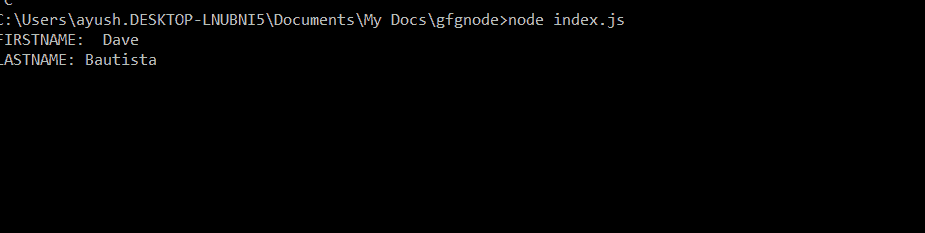
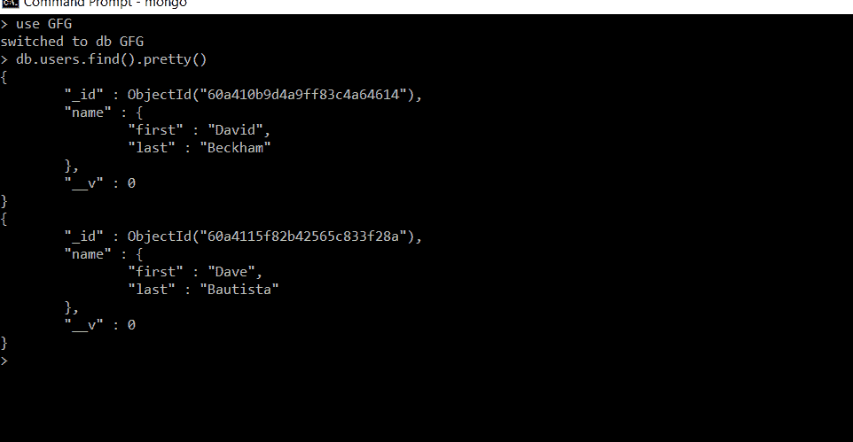

# 猫鼬虚拟

> 原文:[https://www.geeksforgeeks.org/mongoose-virtuals/](https://www.geeksforgeeks.org/mongoose-virtuals/)

**Virtuals** 是文档属性，不持久化，也不存储在 MongoDB 数据库中，它们只在逻辑上存在，不写入文档集合。

使用**获取虚拟属性**的方法，我们可以从现有的文档字段值中设置虚拟属性的值，并返回虚拟属性值。每次我们访问虚拟属性时，Mongoose 都会调用 get 方法。

**安装模块:**

**第一步:**您可以访问[安装猫鼬](https://www.npmjs.com/package/mongoose)链接，获取有关安装 ***猫鼬*** 模块的信息。您可以使用以下命令安装此软件包:

```
npm install mongoose
```

**步骤 2:** 安装猫鼬模块后，可以使用以下代码将其导入文件:

```
const mongoose = require('mongoose');
```

**数据库:**最初，我们在数据库 *GFG* 中有一个空的*用户集合*。



最初，集合用户为空

### 获取方法的实现:

**文件名:app.js**

## java 描述语言

```
// Requiring module
const mongoose = require('mongoose');
const express = require('express');
const app = express();

// Connecting to database
mongoose.connect('mongodb://localhost:27017/GFG',
    {
        useNewUrlParser: true,
        useUnifiedTopology: true,
        useFindAndModify: false
    });

// Constructing mongoose schema
const userSchema = new mongoose.Schema({
    name: {
        first: String,
        last: String
    }
});

// Setting virtual property using get method
userSchema.virtual('name.full')
    .get(function () {
        return this.name.first + ' ' + this.name.last;
    })

// Creating mongoose model
const User = mongoose.model('user', userSchema);

const newUser = new User({
    name: {
        first: "David",
        last: "Beckham"
    }
})

newUser.save()
    .then(u => {
        console.log("USERNAME: ", u.name.full)
    })
    .catch(error => {
        console.log(error);
    })
```

使用以下命令运行 **app.js** 文件:

```
node app.js
```

**输出:**



执行 app.js 后的输出

**数据库:**程序执行后，我们的数据库会是这样的。



执行 app.js 后收集用户

**说明:**此处的模式包含字段 *name.first* 和 *name.last* ，并且有一个虚拟属性 *name.full* 。每当访问 *name.full* 时，都会调用 get 方法，我们将全名作为名和姓的串联。因此，每当我们必须获得全名时，我们不必分别访问名字和姓氏并将其连接起来，相反，我们可以通过虚拟属性轻松获得它们。

使用虚拟属性的**设置**方法，我们可以从虚拟属性的值中设置现有文档字段的值。

#### 集合方法的实现:

**文件名:index.js**

## java 描述语言

```
// Requiring module
const mongoose = require('mongoose');
const express = require('express');
const app = express();

// Connecting to database
mongoose.connect('mongodb://localhost:27017/GFG',
    {
        useNewUrlParser: true,
        useUnifiedTopology: true,
        useFindAndModify: false
    });

// Constructing mongoose schema
const userSchema = new mongoose.Schema({
    name: {
        first: String,
        last: String
    }
});

// Setting the firstname and lastname using set method
userSchema.virtual('name.full')
    .get(function () {
        return this.name.first + ' ' + this.name.last;
    })
    .set(function (value) {
        var fname = value.split(' ');
        this.name.first = fname[0];
        this.name.last = fname[1];
    })

// Creating mongoose model
const User = mongoose.model('user', userSchema);

const newUser = new User({
    name: {
        full: "Dave Bautista"
    }
})

newUser.save()
    .then(u => {
        console.log("FIRSTNAME: ", u.name.first,
                    "\nLASTNAME:", u.name.last)
    })
    .catch(error => {
        console.log(error);
    })
```

使用以下命令运行 **index.js** 文件:

```
node index.js
```

**输出:**



执行 index.js 后的输出

**数据库:**程序执行后，我们的数据库会是这样的。



执行 index.js 后收集用户

**说明:**这里当用户使用虚拟属性 *name.full* 保存文档时，设置功能使用 *name.full* 自动设置字段 *name.first* 和 *name.last* 字段值。因此，在虚拟属性的帮助下，我们不需要为创建文档单独提供每个字段。