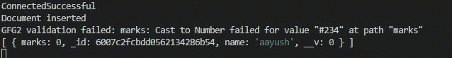
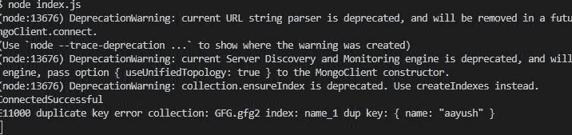

# 使用 Mongoose 模块有什么优势？

> 原文:[https://www . geeksforgeeks . org/使用猫鼬模块的优势是什么/](https://www.geeksforgeeks.org/what-are-the-advantages-of-using-mongoose-module/)

**猫鼬模块**是 NodeJS 最强大的外部模块之一。Mongoose 是 MongoDB ODM(即对象数据库建模)，用于将代码及其表示从 MongoDB 翻译到 Node.js 服务器。

**猫鼬模块优势:**

1.  MongoDB 数据库的集合验证可以很容易地完成。
2.  预定义结构可以在集合上实现。
3.  可以使用 Mongoose 将约束应用于集合的文档。
4.  Mongoose 模块建立在 MongoDB 驱动程序之上，可以轻松地抽象查询并定义查询。

许多习惯于使用 sql 的开发人员在使用 MongoDB 时感到不舒服，因为 Nosql 数据库和灵活的结构在这里 Mongoose 扮演了重要的角色，并使收集模式类似于 SQL 数据库。

Mongoose 模块提供了几个功能来操作 MongoDB 数据库集合中的文档。

**实现明确的结构和集合验证:**猫鼬模块给集合强加了明确的结构，使集合僵化。

**安装模块:**

```
npm install mongoose
```

**项目结构:**


**在本地 IP 上运行服务器:**数据是 MongoDB 服务器所在的目录。

```
mongod --dbpath=data --bind_ip 127.0.0.1
```


**文件名- index.js:**

## java 描述语言

```
// Importing mongoose module
const mongoose = require("mongoose")

// Database Address
const url = "mongodb://localhost:27017/GFG"

// Connecting to database
mongoose.connect(url).then((ans) => {
  console.log("ConnectedSuccessful")
}).catch((err) => {
  console.log("Error in the Connection")
})

// Calling Schema class
const Schema = mongoose.Schema;

// Creating Structure of the collection
const collection_structure = new Schema({
  name: {
    type: String,
    require: true
  },
  marks: {
    type: Number,
    default: 0
  }
})

// Creating collection
const collections = mongoose.model("GFG2", collection_structure)

// Inserting one document
collections.create({
  name: "aayush"
}).then((ans) => {
  console.log("Document inserted")
  // Inserting invalid document
  collections.create({
    name: "saini",
    marks: "#234",
    phone: 981
  }).then((ans) => {
    console.log(ans)
  }).catch((err) => {
    // Printing the documents
    collections.find().then((ans) => {
      console.log(ans)
    })
    // Printing the Error Message
    console.log(err.message)
  })
}).catch((err) => {
  // Printing Error Message
  console.log(err.message)
})
```

使用以下命令运行 **index.js** 文件:

```
node index.js
```

**输出:**



**MongoDB 集合约束的实现:**

**文件名- index.js:**

## java 描述语言

```
// Importing mongoose module
const mongoose = require("mongoose")

// Database Address
const url = "mongodb://localhost:27017/GFG"

// Connecting to database
mongoose.connect(url).then((ans) => {
  console.log("ConnectedSuccessful")
}).catch((err) => {
  console.log("Error in the Connection")
})

// Calling Schema class
const Schema = mongoose.Schema;

// Creating Structure of the collection
const collection_structure = new Schema({
  name: {
    type: String,
    unique: true,
    require: true
  }
  ,
  marks: {
    type: Number,
    default: 0
  }
})

// Creating collection
const collections = mongoose.model("GFG2", collection_structure)

// Inserting one document
collections.create({
  name: "aayush",
  marks: 12,
}).then((ans) => {
  console.log("Document inserted")
  // Inserting invalid document
}).catch((err) => {
  console.log(err.message);
})
```

使用以下命令运行 **index.js** 文件:

```
node index.js
```

**输出:【集合中已经存在第一条记录】**

