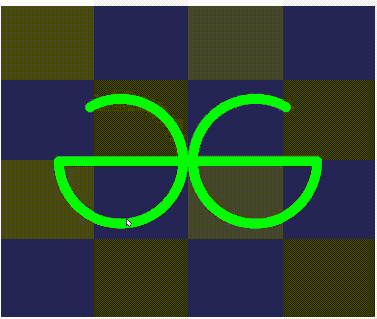
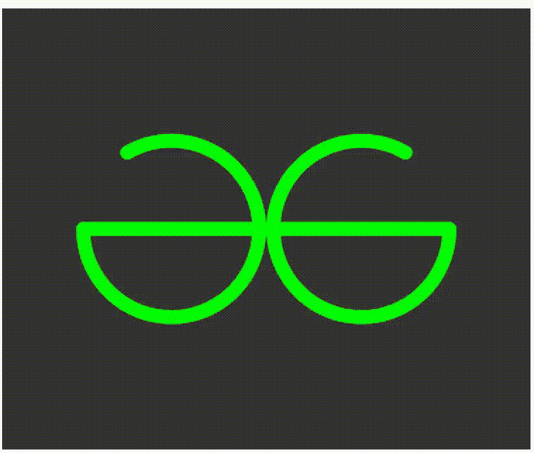

# 如何使用 p5.js 创建 GeeksforGeeks 标志？

> 原文:[https://www . geesforgeeks . org/how-create-geesforgeeks-logo-use-P5-js/](https://www.geeksforgeeks.org/how-to-create-geeksforgeeks-logo-using-p5-js/)

在本文中，我们将看到如何使用 p5.js 创建一个 **GeeksforGeeks** 标志。

Processing 是一个灵活的软件 sketchbook，也是一种学习如何在视觉艺术环境中编码的语言。我们可以使用我们的编码技巧创建不同类型的艺术，例如游戏、动画和物理引擎等。

**进场:**

*   设置输出窗口大小的函数设置()。
*   用随机值初始化变量(偏移量= 108)。
*   在 draw()功能中设置徽标的背景颜色、无填充、描边和位置。
*   然后开始画 logo:
*   创建两个倒“C”形弧。
*   在弧的中间创建两条水平线。
*   使圆弧的中心为零。
*   我们的标志是完整的。

下面是上述方法的实现。

**步骤 1:** 如下图所示创建两个弧:

## java 描述语言

```
// Create arc
arc(width/2 - offset, height/2, 200, 200, -PI + PI/3, PI);
arc(width/2 + offset, height/2, 200, 200, 0, 2*PI - PI/3);
```

**输出:**


**步骤 2:** 创建水平线

## java 描述语言

```
// Horizental lines
line(width/2 + offset + 100*sin(PI/2), height/2, width/2, height/2);
line(width/2 - offset - 100*sin(PI/2), height/2, width/2, height/2);
```



**示例:**

## java 描述语言

```
// Create a variable.

var offset;
function setup() {
  // Set the size of ouput window.
  createCanvas(600, 500);

  // Set the value of offset
  offset = 108;
}

function draw() {

  // Set the background colour.
  background(51);
  noFill();
  stroke(0, 255, 0);
  strokeWeight(16);

  // Set the ellipse mode in center.
  ellipseMode(CENTER);

  // Arc of both sides.
  arc(width/2 - offset, height/2, 200, 200, -PI + PI/3, PI);
  arc(width/2 + offset, height/2, 200, 200, 0, 2*PI - PI/3);

  // Horizental lines
  line(width/2 + offset + 100*sin(PI/2), height/2, width/2, height/2);
  line(width/2 - offset - 100*sin(PI/2), height/2, width/2, height/2);
  push();

  // Make the value of center zero.
  translate(width/2 - offset, height/2);

  pop();
  push();

  // Make the value of center zero.
  translate(width/2 + offset, height/2);

  pop();
}
```

**输出:**

