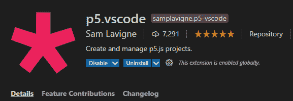
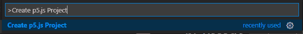
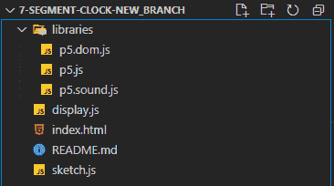
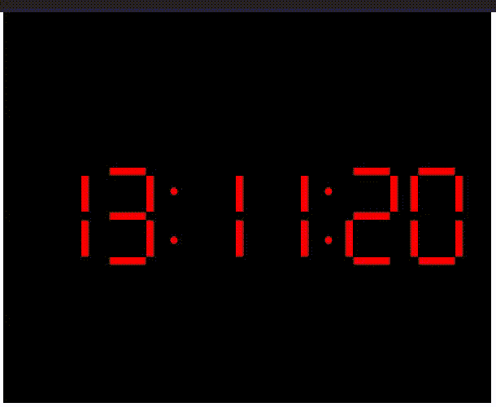

# 如何使用 p5.js 库创建七段时钟？

> 原文:[https://www . geesforgeks . org/如何创建七段时钟-使用-p5-js-library/](https://www.geeksforgeeks.org/how-to-create-seven-segment-clock-using-p5-js-library/)

**七段显示**是显示十进制数字的电子显示设备的一种形式，是更复杂的点阵显示的替代。

**7 段显示时钟**每个段是一个 led，所有 7 个 led 通过一个公共引脚连接在一起，该引脚可以是公共正极或公共负极，并以特定的方式排列。典型的 7 段显示器有 10 个引脚排列在顶部和底部，每个中间引脚都是公共引脚。七段显示器广泛应用于数字时钟、电子仪表、基本计算器和其他显示数字信息的电子设备。

[**p5.js**](https://www.geeksforgeeks.org/p5-js-introduction/) 是一个用于创造性编码的 JavaScript 库，专注于让艺术家、设计师、教育工作者、初学者和其他任何人都可以访问和包容编码！p5.js 是免费和开源的，因为我们相信软件和学习软件的工具应该是每个人都可以访问的。

使用草图的比喻，p5.js 有一整套绘图功能。然而，你并不局限于你的绘画画布。您可以将整个浏览器页面视为您的草图，包括用于文本、输入、视频、网络摄像头和声音的 HTML5 对象。数字 0 到 9 是七段显示屏上最常见的字符。其中最常见的模式是:

```
0 1 2 3 4 5 6 7 8 9
```

**环境设置:**我们将使用**视觉标准代码**来编写我们的代码，以创建七段显示时钟。

*   **步骤 1:** 为了在 Visual Stdio Code 中使用 p5，我们必须安装扩展 p5.vscode，如下图所示。

    

*   **步骤 2:** 现在要创建一个新的 p5.js 项目，请转到**视图- >命令选项板- >创建 p5.js 项目。**

    

**项目结构:**



**示例:**

## 草图. js

```
let display = [];
let colon = [];
let number;
function setup() {
  createCanvas(600, 480);
  let inc = 80;
  let x = 50;
  let j = 0;
  for (let i = 0; i < 6; i++) {
    display[i] = new Display(x, height / 2 - 40, 100);
    if ((i + 1) % 2 == 0) {
      colon[j++] = x + inc;
      x = x + inc + 30;
    } else {
      x = x + inc;
    }
  }
  number = new Array(10);
  initializeArray();
}
function draw() {
  frameRate(1);
  background(0);
  let sec = ("0" + second()).slice(-2);
  let min = ("0" + minute()).slice(-2);
  let hrs = ("0" + hour()).slice(-2);
  console.log(colon);
  display[0].show(number[hrs[0]]);
  display[1].show(number[hrs[1]]);
  display[2].show(number[min[0]]);
  display[3].show(number[min[1]]);
  display[4].show(number[sec[0]]);
  display[5].show(number[sec[1]]);

  fill(255, 0, 0);
  for (let i = 0; i < 2; i++) {
    ellipse(colon[i], height / 2 - 20, 10);
    ellipse(colon[i], height / 2 + 40, 10);
  }
}

function initializeArray() {
  number[0] = [true, true, true, true, true, true, false];
  number[1] = [false, true, true, false, false, false, false];
  number[2] = [true, true, false, true, true, false, true];
  number[3] = [true, true, true, true, false, false, true];
  number[4] = [false, true, true, false, false, true, true];
  number[5] = [true, false, true, true, false, true, true];
  number[6] = [true, false, true, true, true, true, true];
  number[7] = [true, true, true, false, false, false, false];
  number[8] = [true, true, true, true, true, true, true];
  number[9] = [true, true, true, true, false, true, true];
}
```

## index.html

```
<!DOCTYPE html>
<html>
  <head>
    <meta charset="UTF-8" />
    <title>Seven Segment Display</title>
    <script src="libraries/p5.js" 
            type="text/javascript">
    </script>

    <script src="libraries/p5.dom.js" 
            type="text/javascript">
    </script>
    <script src="libraries/p5.sound.js"
            type="text/javascript">
    </script>
    <script src="sketch.js" 
            type="text/javascript">
    </script>
    <script src="display.js" 
            type="text/javascript">
    </script>

    <style>
      body {
        text-align: center;
        padding: 0;
        margin: 0;
      }
      canvas {
        vertical-align: top;
      }
    </style>
  </head>
  <body></body>
</html>
```

## display.js

```
class Display {
  constructor(x, y, size) {
    this.x = x;
    this.y = y;
    this.size = size;
    this.width = 10;
    this.height = size / 2 - this.width / 2;
    this.offset = this.width;
  }

  show(segments) {
    this.edge(this.x, this.y - this.offset, true, segments[0]);
    this.edge(this.x + this.height, this.y, false, segments[1]);
    this.edge(
      this.x + this.height,
      this.y + this.height + this.offset,
      false,
      segments[2]
    );
    this.edge(
      this.x,
      this.y + 2 * this.height + this.offset,
      true,
      segments[3]
    );
    this.edge(
      this.x - this.offset,
      this.y + this.height + this.offset,
      false,
      segments[4]
    );
    this.edge(this.x - this.offset, this.y, false, segments[5]);
    this.edge(this.x, this.y + this.height, true, segments[6]);
  }

  edge(x, y, hor, flag) {
    if (flag) fill(255, 0, 0);
    else fill(0);
    if (hor) rect(x, y, this.height, this.width);
    else rect(x, y, this.width, this.height);
  }
}
```

**输出:**

